# Agents Escalation Workflow

## Agents / Agentic Workflows Name
-   **Agents Escalation Workflow Orchestrator (`_actor_askable` Team)**: The central orchestrator within the Agents Container, managing the conversation flow and interactions between the end-user, the AI agent, and the human approver proxy. Built using the Vanilla AI Agents framework.
-   **Customer Service AI Agent (`agent`)**: An AI agent responsible for handling initial customer inquiries related to item returns, exchanges, and refunds. It uses predefined tools and its underlying language model to process requests and determine if escalation to a human is necessary.
-   **End User Proxy (`enduser` actor)**: Represents the human customer interacting with the chat interface, acting as their proxy within the agentic system.
-   **Approver Proxy (`approver_user` actor)**: Represents the human approver within the agentic system. When the AI agent decides to escalate an issue, this proxy is involved to trigger the human approval process.
-   **Human Escalation Workflow (Azure Logic App)**: An automated workflow that manages the human approval part of the escalation. It is triggered by a message from the Agents Container, sends an approval email to a human agent, processes their response, and sends the decision back into the system.
-   **UI Container (Chainlit & Dapr)**: The user-facing component providing the chat interface and communicating with the backend agents via Dapr pub/sub.
-   **Agents Container (FastAPI & Dapr Actors)**: Hosts the AI agents and orchestration logic, leveraging Dapr for actor state management and messaging.

## Agent / Workflow Description
This project implements a customer service escalation system. A user interacts with a chat interface (Chainlit) to make requests, typically concerning returns, exchanges, or refunds.

The workflow is orchestrated as follows:
1.  The **User** sends a message through the **UI Container**.
2.  The message is published via **Dapr Pub/Sub** (on Azure Service Bus) to the **Agents Container**.
3.  Inside the Agents Container, the **Agents Escalation Workflow Orchestrator (`_actor_askable` Team)** receives the message.
4.  The **End User Proxy** represents the user in this interaction.
5.  The **Customer Service AI Agent (`agent`)** processes the user's inquiry. It can use tools like `check_eligibility` and leverages Azure OpenAI for understanding and responding.
6.  Based on its internal logic and rules (e.g., if the user is not eligible and complains, or if the agent cannot handle the request), the **Customer Service AI Agent** can decide to escalate the issue.
7.  If an escalation is needed, the **Approver Proxy** is involved, leading to a specific message being sent to an Azure Service Bus topic.
8.  This message triggers the **Human Escalation Workflow (Azure Logic App)**.
    * The Logic App parses the incoming data.
    * It formats a summary of the conversation.
    * It sends an approval email (via Office 365) to a designated human approver with "Approve" and "Decline" options.
    * Upon receiving the decision from the human approver, the Logic App sends the outcome (approved/declined) back to another Azure Service Bus topic.
9.  The **Agents Escalation Workflow Orchestrator** in the Agents Container receives this decision.
10. The **Customer Service AI Agent** then formulates a final response to the user based on the human approver's decision.
11. This response is sent back through Dapr Pub/Sub to the **UI Container** and displayed to the user.

The system uses Dapr actors for state management (persisted in Azure Cosmos DB) and Azure OpenAI to power the AI agent's capabilities.

## Domain / Industry
-   Customer Service
-   Retail / E-commerce (due to focus on item returns, exchanges, and refunds)

## Tools / Functions Used By Agents

### Customer Service AI Agent (`agent`):
-   **`check_eligibility(order_number: str, request_type: str) -> str`**: A tool function to check if a customer's request (REFUND, EXCHANGE, RETURN) is eligible based on the provided order number. Returns "Eligible", "Not Eligible", or "Request not recognized".
-   **Azure OpenAI LLM Interaction**: For natural language understanding, decision-making (e.g., when to escalate based on its system prompt and conversation context), and generating responses.

### Human Escalation Workflow (Azure Logic App):
-   **`Parse_JSON`**: Parses the incoming JSON payload from the Service Bus message that triggers the workflow.
-   **`Execute_JavaScript_Code`**: Extracts and formats the last few messages from the conversation data (contained in the parsed JSON) to include in the approval email body.
-   **`Send_approval_email` (Office 365 Connection)**: Sends an email to a predefined address (`foo@example.com`) containing the conversation snippet and "Approve" / "Decline" options for the human agent.
-   **`Switch`**: A control flow action that directs the workflow based on the `SelectedOption` (Approve/Decline) from the approval email.
-   **`Set_variable`**: Sets a `response` variable to a predefined string indicating approval or denial (e.g., "I approve the escalation. Please proceed with the necessary steps.").
-   **`Send_message` (Azure Service Bus Connection)**: Publishes a Dapr-compatible event message containing the approval decision (and original conversation ID) back to an Azure Service Bus topic (`events`) for the Agents Container to consume.

### Supporting System Components & Services:
-   **Dapr Pub/Sub (backed by Azure Service Bus)**: Used for asynchronous messaging between the UI Container, Agents Container, and the Azure Logic App. Topics like `events` and `updates` are used.
-   **Dapr Actors (state stored in Azure Cosmos DB)**: Utilized by the Agents Container (specifically `WorkflowActor`) to manage and persist the state of individual conversations/workflows.
-   **Chainlit**: Framework used to build and serve the chat user interface in the UI Container.
-   **Azure OpenAI Service**: Provides the large language models (LLMs) used by the `Customer Service AI Agent`.
-   **Office 365 API**: Used by the Logic App to send approval emails.

## Architecture Design

```mermaid
graph TD
    User["User via Chainlit UI"] -->|1. Sends message| UIContainer["UI Container App (Chainlit, FastAPI)"]
    
    UIContainer -->|2. Publishes to 'events' topic via Dapr| DaprServiceBus["Dapr Pub/Sub on Azure Service Bus"]
    
    DaprServiceBus -->|3. Message to 'workflow' subscriber| AgentsContainer["Agents Container App (Vanilla AI Agents, FastAPI, Dapr Actors)"]
    
    subgraph AgentsContainer
        TeamOrchestrator["Team Orchestrator ('_actor_askable')"]
        CSSAgent["Customer Service AI Agent ('agent')"]
        ToolCheckEligibility["Tool: check_eligibility()"]
    end

    TeamOrchestrator -->|Coordinates| CSSAgent
    CSSAgent -->|Uses LLM for NLU/NRG & decisions| AzureOpenAI["Azure OpenAI Service"]
    CSSAgent -->|Calls tool| ToolCheckEligibility

    %% Normal Path
    AgentsContainer -->|4b. Direct response via 'updates' topic| DaprServiceBus
    DaprServiceBus -->|5b. Update to 'ui' subscriber| UIContainer
    UIContainer -->|6b. Displays response| User
    
    %% Escalation Path
    AgentsContainer -->|4a. Escalation message to 'events' topic| DaprServiceBus2["Dapr Pub/Sub (Escalation)"]
    DaprServiceBus2 -->|5a. Triggers| LogicApp["Azure Logic App 'Approval Email Workflow'"]
    
    subgraph LogicApp
        direction LR
        L_Parse["Parse Message"] --> L_Format["Format Email"] --> L_SendMail["Send Email via Office 365"]
        L_SendMail --> HumanApprover["Human Approver via Email"]
        HumanApprover --> L_Decision["Process Decision"]
        L_Decision --> L_FormatResp["Format SB Response"] --> L_SendToSB["Send Decision to Service Bus"]
    end

    LogicApp -->|9a. Publishes decision to 'events' topic| DaprServiceBus3["Dapr Pub/Sub (Decision)"]
    DaprServiceBus3 -->|10a. Decision to| AgentsContainer

    AgentsContainer -->|State persistence for Actors| AzureCosmosDB["Azure Cosmos DB"]
```

The architecture illustrates a user interacting with a Chainlit UI, with messages routed via Dapr Pub/Sub on Azure Service Bus. The Agents Container, using Vanilla AI Agents and Dapr Actors, processes these messages. It leverages Azure OpenAI for AI capabilities and can use tools like `check_eligibility`. If escalation is required, a message is sent to an Azure Logic App, which manages the human approval process via Office 365 email. The decision is then relayed back to the Agents Container, and a final response is provided to the user. Dapr Actors persist their state in Azure Cosmos DB.
