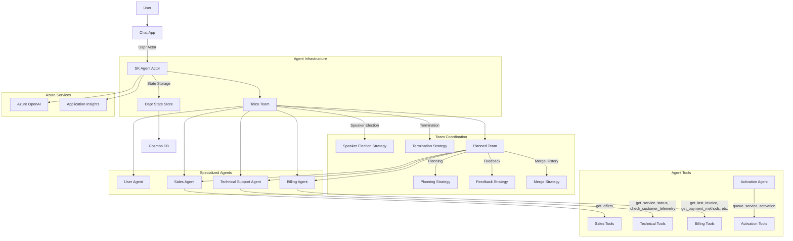

# AI Customer Support Agents

## Agents / Agentic Workflows Name

- **Sales Agent**: Provides information about available offers and plans
- **Technical Support Agent**: Resolves technical issues and checks service status
- **Billing Agent**: Handles billing-related inquiries and payment methods
- **Activation Agent**: Helps customers activate purchased services
- **User Agent**: Represents the human user in the conversation
- **Planned Team**: Special orchestration agent that handles complex cross-domain requests
- **Telco Team**: Top-level team that coordinates all agents

## Agent / Workflow Description

This is a customer support agentic workflow for a telecommunications company. The system orchestrates multiple specialized agents to handle different aspects of customer inquiries:

1. The **Telco Team** uses a speaker election strategy to determine which agent should respond to each user message
2. The **Sales Agent** provides information about available offers and plans
3. The **Technical Support Agent** diagnoses and resolves technical issues by checking service status and customer telemetry
4. The **Billing Agent** helps with invoice retrieval, payment methods, and usage metrics
5. The **Activation Agent** collects necessary information to activate purchased services
6. The **Planned Team** coordinates multiple agents for complex queries that span different domains, creating a plan with specific steps for each agent
7. The system uses a termination strategy to determine when to stop and return control to the user

## Domain / Industry

Telecommunications

## Tools / Functions Used By Agents

### Sales Agent:
- `get_offers`: Returns available sales offers without internal fields

### Technical Agent:
- `get_service_status`: Checks the status of specified services
- `check_customer_telemetry`: Retrieves telemetry data for a customer's service

### Billing Agent:
- `get_last_invoice`: Retrieves the last invoice for a customer
- `get_payment_methods`: Returns available payment methods for a customer
- `change_payment_method`: Updates a customer's payment method
- `get_usage_metrics`: Returns telco service usage metrics (voice, data, SMS)

### Activation Agent:
- `queue_service_activation`: Processes service activation requests with customer data

### Selection Strategy:
- `SpeakerElectionStrategy`: Determines which agent should respond next based on conversation context
- `UserInputRequiredTerminationStrategy`: Determines when to stop the conversation and wait for user input

### Planning Strategy:
- `DefaultPlanningStrategy`: Creates a plan for solving complex inquiries using multiple agents
- `FeedbackStrategy`: Provides feedback on plan execution and determines if iteration is needed
- `MergeHistoryStrategy`: Merges conversation histories after plan execution

## Architecture Design

The architecture shows a multi-agent system with specialized roles working together through team coordination mechanisms. The system leverages Dapr Actors for scalable stateful conversations and Azure OpenAI for LLM capabilities. Agents are selected based on the conversation context, and complex queries are handled by creating multi-step plans across different specialized agents.
