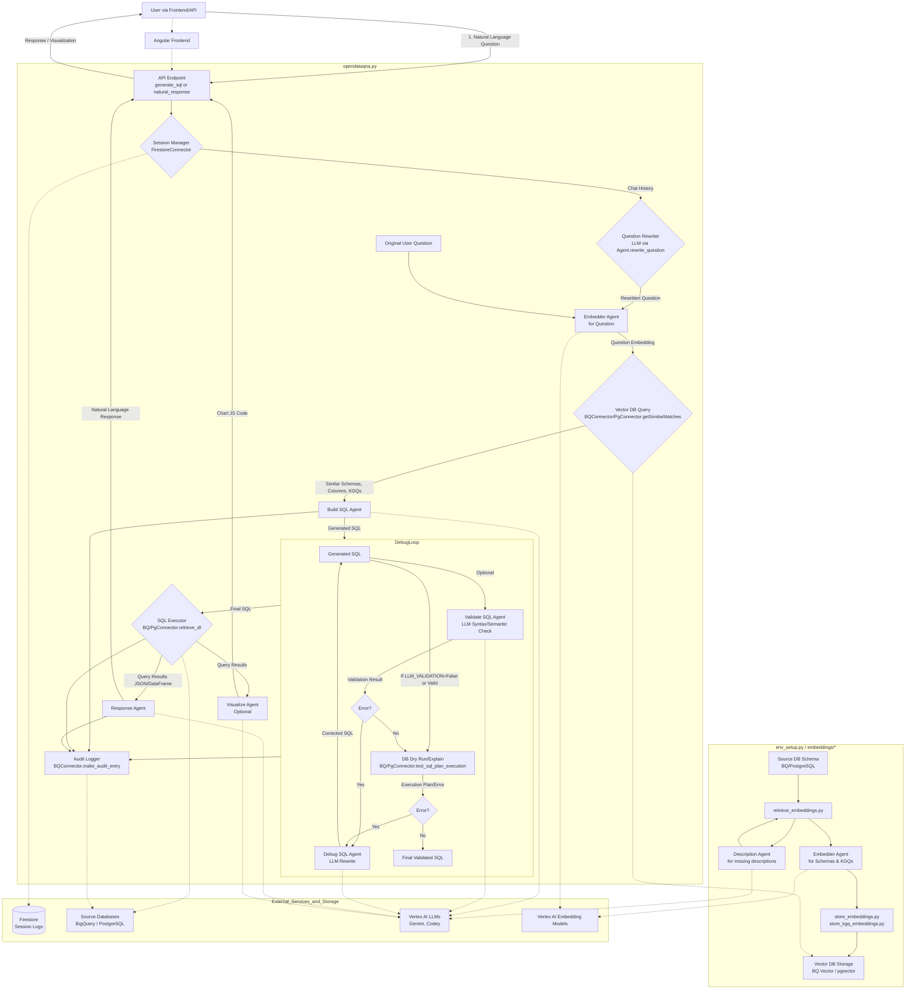

# Open Data QnA - Text-to-SQL & Data Interaction Workflow

## Agents / Agentic Workflows Name

The system is orchestrated by the `opendataqna.py` script, which coordinates several specialized agents defined in the `/agents` directory. Each agent is a Python class inheriting from a base `Agent` class (in `agents/core.py`) and utilizes Vertex AI models.

-   **Orchestrator (`opendataqna.py`)**: Manages the end-to-end flow from user question to final response.
-   **Embedder Agent (`agents/EmbedderAgent.py`)**: Generates text embeddings for user questions, database schema descriptions, and known good queries (KGQs). Uses Vertex AI `TextEmbeddingModel` or LangChain's `VertexAIEmbeddings`.
-   **Description Agent (`agents/DescriptionAgent.py`)**: Generates natural language descriptions for database tables and columns if they are missing, using an LLM. This enriches the metadata used for SQL generation.
-   **Build SQL Agent (`agents/BuildSQLAgent.py`)**: Constructs SQL queries from natural language questions. It uses context from retrieved similar table/column schemas, KGQs, session history, and database-specific information.
-   **Validate SQL Agent (`agents/ValidateSQLAgent.py`)**: Validates the syntax and semantic correctness of the generated SQL queries using an LLM.
-   **Debug SQL Agent (`agents/DebugSQLAgent.py`)**: Iteratively attempts to fix incorrect SQL queries based on error messages from validation or dry runs, using an LLM for rewriting.
-   **Response Agent (`agents/ResponseAgent.py`)**: Generates natural language summaries and answers from the results of executed SQL queries.
-   **Visualize Agent (`agents/VisualizeAgent.py`)**: Suggests appropriate chart types and generates JavaScript code for Google Charts to visualize SQL query results.

## Agent / Workflow Description

The Open Data QnA system processes a user's natural language question to retrieve data from a configured SQL database (PostgreSQL or BigQuery) through a multi-step agentic workflow:

1.  **Initialization & Setup (`env_setup.py`, `embeddings/`):**
    * The system first requires schema information (tables, columns, descriptions) and optionally "Known Good Queries" (KGQs) to be processed.
    * The **Description Agent** generates descriptions for tables and columns if they are missing from the source database metadata.
    * The **Embedder Agent** creates vector embeddings for:
        * Detailed descriptions of table schemas.
        * Detailed descriptions of column schemas (including data types, constraints, and sample values if `USE_COLUMN_SAMPLES` is true).
        * User questions from the KGQ dataset.
    * These embeddings are stored in a configured vector store (PostgreSQL with pgvector or BigQuery Vector Search) via functions in `embeddings/store_embeddings.py` and `embeddings/kgq_embeddings.py`.

2.  **User Query Processing (`opendataqna.py` orchestrates this):**
    * A **User** submits a natural language question via an interface (e.g., Streamlit UI in `app.py` or an API call to `backend-apis/main.py`). A session ID is used to track conversation history.
    * **(Optional) Question Rewriting**: If session history (`USE_SESSION_HISTORY`) is enabled and available (stored in Firestore via `dbconnectors/FirestoreConnector.py`), the user's current question may be rewritten by agents like `BuildSQLAgent` or `ResponseAgent` using their `rewrite_question` method to incorporate conversational context.
    * The (potentially rewritten) user question is converted into an embedding by the **Embedder Agent**.
    * **(Optional) Exact Match Retrieval**: If KGQs (`EXAMPLES`) are enabled, the system first checks for an exact match of the user question in the KGQ vector store using `vector_connector.getExactMatches()`. If found, the corresponding pre-verified SQL is used, bypassing further generation.
    * **Context Retrieval (Similarity Search)**:
        * The **Embedder Agent**'s output (question embedding) is used to query the vector store.
        * The `vector_connector` (either `BQConnector` or `PgConnector`) retrieves the most similar:
            * Table schema descriptions (`num_table_matches`, `table_similarity_threshold`).
            * Column schema descriptions (`num_column_matches`, `column_similarity_threshold`).
            * KGQ examples (user question + SQL pairs) if enabled (`num_sql_matches`, `example_similarity_threshold`).
    * **SQL Generation**:
        * The **Build SQL Agent** receives the (rewritten) user question, retrieved similar schemas, KGQ examples, session history, and database type (BigQuery/PostgreSQL).
        * It uses its configured LLM (e.g., Gemini 1.5 Pro, Codey) and a detailed prompt (from `prompts.yaml`, specific to the database type) to generate an SQL query.
    * **SQL Validation & Debugging (Iterative Loop if `RUN_DEBUGGER` is true)**:
        * The generated SQL is first optionally validated by the **Validate SQL Agent** if `LLM_VALIDATION` is true. This agent uses an LLM to check for syntax and semantic issues against the schema.
        * If the LLM validation passes (or is skipped), the SQL query undergoes a dry run or execution plan check using the appropriate database connector (`bqconnector.test_sql_plan_execution` or `pgconnector.test_sql_plan_execution`).
        * If any errors are detected (either by `ValidateSQLAgent` or the dry run), the **Debug SQL Agent** is invoked. It takes the faulty SQL, error message, original question, and schema context, and uses its LLM to generate a corrected SQL query.
        * This validation-debugging loop can repeat for a configured number of `DEBUGGING_ROUNDS`.
    * **SQL Execution**:
        * If the final SQL query is deemed valid (or if debugging is disabled/exhausted), and `EXECUTE_FINAL_SQL` is true, the query is executed against the target database (BigQuery or PostgreSQL) using the respective `dbconnector`. The results are typically returned as a Pandas DataFrame.
    * **Response Generation**:
        * The **Response Agent** takes the original user question and the JSON representation of the SQL query results.
        * It uses its LLM and a specific prompt (`PROMPTS['nl_reponse']`) to generate a natural language summary or answer based on the data.
    * **(Optional) Visualization**:
        * The **Visualize Agent** can be invoked with the user question, generated SQL, and SQL results.
        * It first uses an LLM (`getChartType`) to suggest two appropriate Google Chart types (e.g., Bar Chart, Pie Chart).
        * Then, for each suggested type, it generates JavaScript code (`getChartPrompt` + LLM call) for rendering the chart using Google Charts.
    * **Logging**: If `LOGGING` is enabled, details of the interaction (question, SQL, errors, etc.) are logged, typically to a BigQuery table using `bqconnector.make_audit_entry()`. Session history is logged to Firestore.
    * **Feedback/KGQ Update**: The system allows for generated SQL to be marked as good and embedded into the KGQ store for future use via the `/embed_sql` API endpoint, which calls `opendataqna.embed_sql()`.

## Domain / Industry
-   Data Analytics & Business Intelligence
-   Natural Language Processing (NLP) for Databases
-   Automated SQL Generation
-   Data Visualization
-   Cloud Data Warehousing (BigQuery, PostgreSQL on Cloud SQL)

## Tools / Functions Used By Agents

### Embedder Agent (`agents/EmbedderAgent.py`):
-   `create(question)`: Generates embeddings.
    -   Uses Vertex AI `TextEmbeddingModel.from_pretrained('text-embedding-004')` or LangChain `VertexAIEmbeddings`.

### Description Agent (`agents/DescriptionAgent.py`):
-   `generate_missing_descriptions(source, table_desc_df, column_name_df)`: Fills in missing table/column descriptions.
    -   Uses its configured LLM (e.g., Gemini) via `generate_llm_response` method.

### Build SQL Agent (`agents/BuildSQLAgent.py`):
-   `build_sql(...)`: Generates SQL query.
    -   Uses Vertex AI `CodeChatModel` or `GenerativeModel` (e.g., Gemini 1.5 Pro).
    -   Relies on formatted prompts from `utilities.PROMPTS['buildsql_<source_type>']`.
    -   `rewrite_question(question, session_history)`: Refines question based on chat history.
    -   `get_last_sql(session_history)`: Retrieves previous SQL for context.
-   **Database Connectors** (via `opendataqna.py`'s context retrieval):
    -   `vector_connector.getSimilarMatches()`: For fetching relevant table/column schemas and KGQs.

### Validate SQL Agent (`agents/ValidateSQLAgent.py`):
-   `check(...)`: Validates SQL.
    -   Uses its configured LLM (e.g., Gemini) with prompt `utilities.PROMPTS['validatesql']`.

### Debug SQL Agent (`agents/DebugSQLAgent.py`):
-   `start_debugger(...)`: Orchestrates the debugging loop.
    -   `init_chat(...)`: Initializes a chat session with its LLM using prompt `utilities.PROMPTS['debugsql_<source_type>']`.
    -   `rewrite_sql_chat(...)`: Sends faulty SQL and error to LLM for correction.
-   **Tools used indirectly**:
    -   `ValidateSQLAgent.check()` (if `LLM_VALIDATION` is true).
    -   `dbconnector.test_sql_plan_execution()` for dry runs.

### Response Agent (`agents/ResponseAgent.py`):
-   `run(user_question, sql_result)`: Generates natural language response.
    -   Uses its configured LLM (e.g., Gemini) with prompt `utilities.PROMPTS['nl_reponse']`.
    -   `rewrite_question(question, session_history)`: Refines question based on chat history.

### Visualize Agent (`agents/VisualizeAgent.py`):
-   `generate_charts(...)`: Generates Google Charts JavaScript.
    -   `getChartType(...)`: Uses LLM with prompt `PROMPTS['visualize_chart_type']` to suggest chart types.
    -   `getChartPrompt(...)`: Creates prompt for LLM.
    -   Uses LLM with prompt `PROMPTS['visualize_generate_chart_code']` to generate JS code.

### Orchestrator (`opendataqna.py`):
-   `generate_sql()`: Main SQL generation pipeline function.
-   `get_results()`: Executes SQL.
-   `get_response()`: Generates natural language response.
-   `visualize()`: Generates visualizations.
-   `run_pipeline()`: Calls the above in sequence.
-   `embed_sql()`: Adds successfully validated SQL to KGQ store.
-   **Database Connectors** (`dbconnectors`):
    -   `PgConnector`: For PostgreSQL interactions (data & vector via pgvector).
    -   `BQConnector`: For BigQuery interactions (data & vector via BQ Vector Search).
    -   `FirestoreConnector`: For logging chat session history.
-   **Embedding Utilities** (`embeddings/`):
    -   `retrieve_embeddings.retrieve_embeddings()`: Fetches schema and calls `DescriptionAgent`.
    -   `store_embeddings.store_schema_embeddings()`: Saves schema embeddings to vector DB.
    -   `kgq_embeddings.setup_kgq_table()`, `store_kgq_embeddings()`: Manages KGQ embeddings.

### Backend API (`backend-apis/main.py`):
-   Flask framework: To expose `opendataqna.py` functionalities as HTTP endpoints.
-   Firebase Admin SDK: For JWT authentication.

## Architecture Design

This Open Data QnA system provides a comprehensive agentic pipeline for converting natural language questions into actionable database queries and human-readable results. It employs a series of specialized AI agents for tasks like embedding, SQL generation, validation, debugging, natural language response generation, and visualization, all orchestrated to work with Google Cloud's database and AI services.
