# Vanna: AI-Powered SQL Generation Framework

## Agents / Agentic Workflows Name

Vanna is a modular framework. The core orchestrator (`VannaBase`) is combined with specific LLM and Vector Store components to create a functional Text-to-SQL agent.

-   **`Vanna` Instance (Primary Agent/Orchestrator):**
    A concrete implementation of `VannaBase` (e.g., `VannaDefault` which uses `VannaDB_VectorStore` and an LLM, or a custom class like `MyVanna` combining `ChromaDB_VectorStore` and `OpenAI_Chat`). This instance manages the overall workflow from training to answering questions.
    -   **LLM Service Client (Sub-Agent/Tool):** An instance of an LLM interface class (e.g., `OpenAI_Chat`, `Anthropic_Chat`, `GoogleGeminiChat`, `Mistral`, `Ollama`, `Hf`, etc.). Responsible for all LLM interactions like SQL generation, Plotly code generation, summarization, and natural language explanations.
    -   **Vector Store Client (Sub-Agent/Tool):** An instance of a Vector Store interface class (e.g., `ChromaDB_VectorStore`, `AzureAISearch_VectorStore`, `PineconeDB_VectorStore`, `PG_VectorStore`, etc.). Manages the RAG aspect by storing, indexing, and retrieving training data (DDL, documentation, Q&A pairs) using vector embeddings.
    -   **Embedding Model (Tool):** Used by the Vector Store Client (or directly if the Vector Store requires pre-computed embeddings) to generate vector representations of text data. Examples include `fastembed`, `OpenAI_Embeddings`, `Cohere_Embeddings`, or models integrated within vector store components.
    -   **SQL Database Connector (Tool):** Established via `vn.connect_to_<database>()` methods. Used by `VannaBase` to execute SQL queries and potentially extract schema information for training.
    -   **Plotly Engine (Tool):** The Plotly library, used internally by `VannaBase` to generate chart objects from Plotly Python code produced by the LLM Service Client.
    -   **`VannaAdvanced` (Optional Function Management Component):** An abstract interface for managing (CRUD operations) predefined, parameterized SQL functions or templates. This allows for more complex and reusable query patterns.

## Agent / Workflow Description

Vanna is an open-source Python RAG (Retrieval-Augmented Generation) framework designed for generating SQL queries from natural language questions and related functionalities. It enables users to "train" a model by providing database schema (DDL statements), documentation, and example SQL queries. This information is used to augment the context provided to a Large Language Model (LLM) for accurate SQL generation.

The primary workflows are:

1.  **Training Workflow:**
    *   The user provides training data to the `Vanna` instance using methods like `vn.train()` or specific `vn.add_ddl()`, `vn.add_documentation()`, `vn.add_question_sql()`.
    *   The **Vector Store Client** takes this data.
    *   The **Embedding Model** (either part of the Vector Store or called by it) generates vector embeddings for the textual training data.
    *   The Vector Store Client stores the original data along with its vector embedding in the chosen vector database.

2.  **Question Answering Workflow (`vn.ask(question=...)`):**
    *   The **`Vanna` Instance (Orchestrator)** receives a natural language question from the user.
    *   **Context Retrieval (RAG):**
        *   The Orchestrator uses the **Embedding Model** to generate an embedding for the user's question.
        *   It then queries the **Vector Store Client** with this embedding to find relevant DDL statements (`get_related_ddl`), documentation (`get_related_documentation`), and similar question-SQL pairs (`get_similar_question_sql`).
    *   **SQL Generation:**
        *   The Orchestrator constructs a detailed prompt containing the user's question, the retrieved context, and system instructions (e.g., dialect, response format).
        *   This prompt is sent to the **LLM Service Client** (`submit_prompt` via `generate_sql`).
        *   The LLM Service Client interacts with the external LLM API to generate the SQL query.
        *   The Orchestrator extracts the SQL from the LLM's response (`extract_sql`).
    *   **SQL Execution (Optional):**
        *   If a database connection is configured (via `vn.connect_to_<database>()`), the Orchestrator validates the SQL (`is_sql_valid`) and executes it using the **SQL Database Connector** (`run_sql`).
        *   The results are returned as a Pandas DataFrame.
    *   **Auto-Training (Optional):**
        *   If `auto_train` is enabled and the SQL execution is successful, the question-SQL pair is added to the training data via the **Vector Store Client**.
    *   **Visualization (Optional):**
        *   If `visualize` is enabled and a DataFrame is produced, the Orchestrator requests Plotly code from the **LLM Service Client** (`generate_plotly_code`), providing the question, SQL, and DataFrame metadata.
        *   The generated Plotly code is then executed using the **Plotly Engine** (`get_plotly_figure`) to create a visual chart.
    *   **Follow-up and Summarization (Optional):**
        *   The Orchestrator can use the **LLM Service Client** to generate follow-up questions (`generate_followup_questions`) or a natural language summary of the results (`generate_summary`).
    *   The Orchestrator returns the generated SQL, DataFrame (if executed), Plotly figure (if visualized), and other relevant information to the user.

3.  **Function Management Workflow (via `VannaAdvanced` - Optional):**
    *   Users can define, retrieve, update, or delete parameterized SQL functions/templates.
    *   `create_function`: May involve using the **LLM Service Client** to help structure or generalize a given question and SQL into a template.
    *   `get_function`: When a user asks a question that maps to a predefined function, this component can retrieve and instantiate the template, potentially with LLM assistance for parameter filling.
    *   Function definitions are typically stored and retrieved using the **Vector Store Client** or a similar mechanism.

## Domain / Industry

-   **Primary Domain:** Text-to-SQL, AI-assisted Database Querying, Retrieval-Augmented Generation (RAG) for tabular data, Business Intelligence, Data Analytics.
-   **Applicable Industries:** Vanna is industry-agnostic. It can be applied to any domain where data is stored in SQL databases and users need to query this data using natural language. Examples include:
    -   Retail (e.g., sales analysis, customer behavior)
    -   Finance (e.g., transaction reporting, risk assessment)
    -   Healthcare (e.g., patient data analysis, operational metrics)
    -   Technology (e.g., product usage analytics, A/B testing results)
    -   E-commerce (e.g., analyzing sales, customer behavior)
    -   Music Industry (as seen with the Chinook sample database)

## Tools / Functions Used By Agents

### `Vanna` Instance (Orchestrator - `VannaBase` derived)
-   `ask(question, ...)`: Manages the end-to-end process of answering a question.
-   `train(ddl, documentation, sql, plan, ...)`: Manages adding various types of training data.
-   `generate_sql(question, ...)`: Orchestrates context retrieval and calls the LLM Interface to get SQL.
-   `extract_sql(llm_response)`: Parses LLM response to get the SQL query.
-   `is_sql_valid(sql)`: Checks if the generated SQL is of an allowed type (e.g., SELECT).
-   `run_sql(sql, ...)`: Executes SQL via the SQL Database Connector.
-   `generate_plotly_code(question, sql, df_metadata, ...)`: Calls LLM Interface to get Plotly code.
-   `get_plotly_figure(plotly_code, df, ...)`: Uses Plotly library to render chart.
-   `generate_summary(question, df, ...)`: Calls LLM Interface for a summary.
-   `generate_followup_questions(question, sql, df, ...)`: Calls LLM Interface for follow-up questions.
-   `connect_to_<database_type>(...)`: Configures the SQL Database Connector.
-   `get_training_plan_<database_type>(...)`: Extracts schema information from a database to create a training plan.

### LLM Service Client (e.g., `OpenAI_Chat`, `Anthropic_Chat`)
-   `submit_prompt(prompt, **kwargs)`: Sends the formatted prompt to the external LLM API and returns the response.
-   `system_message(message)`, `user_message(message)`, `assistant_message(message)`: Helper methods to structure prompts according to the LLM's requirements.
-   Relies on external LLM provider SDKs (e.g., `openai.OpenAI().chat.completions.create`, `anthropic.Anthropic().messages.create`).

### Vector Store Client (e.g., `ChromaDB_VectorStore`, `VannaDB_VectorStore`)
-   `generate_embedding(data, **kwargs)`: Generates vector embeddings for input text, often delegating to an Embedding Model.
-   `add_question_sql(question, sql, **kwargs)`: Stores a question-SQL pair and its embedding.
-   `add_ddl(ddl, **kwargs)`: Stores a DDL statement and its embedding.
-   `add_documentation(documentation, **kwargs)`: Stores a documentation string and its embedding.
-   `get_similar_question_sql(question, **kwargs)`: Retrieves relevant question-SQL pairs via vector similarity search.
-   `get_related_ddl(question, **kwargs)`: Retrieves relevant DDL statements via vector similarity search.
-   `get_related_documentation(question, **kwargs)`: Retrieves relevant documentation via vector similarity search.
-   `get_training_data(**kwargs)`: Fetches all stored training data.
-   `remove_training_data(id, **kwargs)`: Deletes specific training data.
-   Interacts with the specific vector database's API (e.g., `chromadb.Collection.add`, `chromadb.Collection.query`, `requests.post` for `VannaDB_VectorStore`).

### Embedding Model (e.g., `fastembed.TextEmbedding`, `OpenAI_Embeddings`, `Cohere_Embeddings`)
-   `embed(data)` or `generate_embedding(data)`: Takes text data and returns its vector embedding.

### `VannaAdvanced` Component (Function Management)
-   `get_function(question, additional_data)`: Retrieves and instantiates a predefined function based on a question.
-   `create_function(question, sql, plotly_code, **kwargs)`: Generates and stores a new structured SQL function/template.
-   `update_function(old_function_name, updated_function)`: Modifies an existing function.
-   `delete_function(function_name)`: Removes a function.
-   `get_all_functions()`: Lists all stored functions.

### External Services & Libraries
-   **LLM APIs:** OpenAI, Anthropic, Google Gemini, Mistral, Ollama, HuggingFace, AWS Bedrock, etc.
-   **Vector Databases:** ChromaDB, Pinecone, Azure AI Search, Weaviate, Qdrant, Marqo, Milvus, FAISS, PGVector, Oracle DB Vector, BigQuery Vector Search, VannaDB (hosted).
-   **Embedding Providers:** OpenAI, Cohere, Fastembed, Sentence-Transformers.
-   **SQL Databases:** SQLite, Snowflake, PostgreSQL, MySQL, BigQuery, DuckDB, MSSQL, etc. (via SQLAlchemy or specific connectors).
-   **Plotly:** For generating interactive charts.
-   **Pandas:** For data manipulation.
-   **Requests:** For HTTP communication (e.g., by `VannaDB_VectorStore`).

## Architecture Design

```mermaid
graph TD
    UserInterface["User (e.g. Jupyter, Flask App, CLI)"]
    
    UserInterface -- "Natural Language Question / Training Data (DDL, Docs, SQL)" --> VannaInstance["Vanna Instance (VannaBase Implementation)"]
    
    subgraph VannaInstance
        Orchestrator["VannaBase (Core Workflow Logic)"]
        LLMInterface["LLM Interface (e.g., OpenAI_Chat)"]
        VectorStoreInterface["Vector Store Interface (e.g., ChromaDB_VectorStore)"]
        FunctionManager["VannaAdvanced (Optional Function Manager)"]
    end

    Orchestrator -- "Manages ask() and train() workflows" --> UserInterface
    
    %% Ask Workflow
    Orchestrator -- "1. Get Context for Question" --> VectorStoreInterface
    VectorStoreInterface -- "Retrieves DDL, Docs, Similar SQL" --> ExternalVectorDB[(Vector Database)]
    ExternalVectorDB -- "Context Data" --> VectorStoreInterface
    VectorStoreInterface -- "Relevant Context" --> Orchestrator
    
    Orchestrator -- "2. Generate SQL (Prompt: Question + Context)" --> LLMInterface
    LLMInterface -- "SQL Generation Request" --> ExternalLLM[External LLM API]
    ExternalLLM -- "Generated SQL (in text)" --> LLMInterface
    LLMInterface -- "Raw LLM Output" --> Orchestrator
    Orchestrator -- "extract_sql()" --> Orchestrator
    
    Orchestrator -- "3. Execute SQL (Optional, via run_sql)" --> ExternalSQLDB[(SQL Database)]
    ExternalSQLDB -- "DataFrame Results" --> Orchestrator
    
    Orchestrator -- "4. Auto-Train (Optional, if SQL successful)" --> VectorStoreInterface
    
    Orchestrator -- "5. Generate Plot (Optional)" --> LLMInterface
    LLMInterface -- "Plotly Code Generation Request" --> ExternalLLM
    ExternalLLM -- "Plotly Python Code" --> LLMInterface
    LLMInterface -- "Plotly Code" --> Orchestrator
    Orchestrator -- "Plotly Code + DataFrame" --> PlotlyLib([Plotly Library])
    PlotlyLib -- "Interactive Chart" --> Orchestrator
    
    Orchestrator -- "Generated SQL, DataFrame, Chart" --> UserInterface

    %% Training Workflow
    Orchestrator -- "Add Training Data (DDL, Docs, SQL)" --> VectorStoreInterface
    VectorStoreInterface -- "Embeds & Stores Data" --> EmbeddingModel[Embedding Model]
    EmbeddingModel -- "Embeddings" --> VectorStoreInterface
    VectorStoreInterface -- "Data + Vectors" --> ExternalVectorDB
    
    %% Function Management
    FunctionManager -- "CRUD Operations for Functions" --- LLMInterface
    FunctionManager -- "Store/Retrieve Function Definitions" --- VectorStoreInterface

    %% Connect_to_DB for schema introspection for training plan
    Orchestrator -- "Get Training Plan (e.g. get_training_plan_snowflake)" --> ExternalSQLDB
```

The Vanna framework provides a flexible RAG-based system for Text-to-SQL generation. It uses an LLM for generation tasks and a Vector Database for retrieving relevant contextual information from user-provided training data (DDL, documentation, SQL examples). The core `VannaBase` class orchestrates these components, handling user queries, training data management, SQL execution, and optional chart generation. Users can customize the LLM, Vector Database, and Embedding Model components to suit their specific needs and infrastructure. The `VannaAdvanced` component offers capabilities for managing more structured, parameterized SQL functions.
