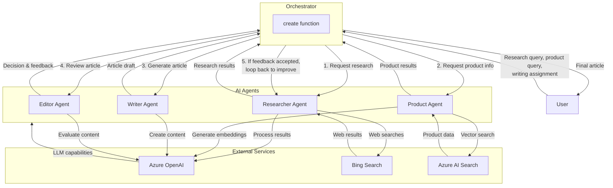

# Creative Writer Agent

## Agents / Agentic Workflows Name
- **Researcher Agent**: Finds information on the web using Bing Search
- **Product Agent**: Retrieves relevant product information using vector search
- **Writer Agent**: Creates articles using research and product information
- **Editor Agent**: Reviews articles and provides feedback
- **Orchestrator**: Coordinates the entire workflow between agents

## Agent / Workflow Description
This is a content creation agentic workflow for an outdoor retailer (Contoso). The system orchestrates multiple specialized agents to create blog articles:

1. The **Orchestrator** coordinates the entire workflow, passing information between agents and handling the feedback loop
2. The **Researcher Agent** uses Bing Search to find relevant information based on user queries
3. The **Product Agent** finds relevant products using vector search and embeddings
4. The **Writer Agent** creates an article using the research and product information
5. The **Editor Agent** reviews the article and decides whether to accept it or provide feedback
6. If feedback is provided, the Orchestrator loops back to the Researcher and Writer agents to improve the article

## Domain / Industry
Retail

## Tools / Functions Used By Agents

### Researcher Agent:
- `find_information`: Web search for general information
- `find_entities`: Search for people, places, or things
- `find_news`: Search for news articles
- Uses Azure OpenAI and Bing Search API

### Product Agent:
- `generate_embeddings`: Creates vector embeddings for queries
- `retrieve_products`: Vector search for products
- `find_products`: Combines query generation, embedding, and retrieval
- Uses Azure OpenAI and Azure AI Search

### Writer Agent:
- `write`: Generates article content using research and product data
- `process`: Processes the writer's response
- Uses Azure OpenAI

### Editor Agent:
- `edit`: Reviews article and decides on feedback
- Uses Azure OpenAI

### Additional Tools:
- Content safety evaluation
- Article quality evaluation (relevance, fluency, coherence, groundedness)
- Image content safety evaluation

## Architecture Design

The architecture shows a multi-agent system with specialized roles working together through the orchestrator to create high-quality articles that incorporate both web research and product information, with an editorial feedback loop to ensure quality.
