# SWE-agent

## Agents / Agentic Workflows Name

SWE-agent operates primarily as a single sophisticated agent but can be configured and extended in ways that resemble multi-agent workflows or involve specialized components:

* **SWE-agent Core (`DefaultAgent`)**: The primary agent responsible for understanding software engineering tasks, interacting with the codebase and environment, generating patches, and attempting to solve given problems.
* **Retry Orchestrator (`RetryAgent`)**: A meta-agent configuration that manages multiple attempts by `DefaultAgent` instances. It uses a retry loop strategy to improve success rates. This orchestrator can utilize:
    * **Reviewer (`Reviewer`)**: A component (often LM-based) used within some retry loops to score submissions from `DefaultAgent` attempts.
    * **Chooser (`Chooser`)**: A component (often LM-based) used within some retry loops to select the best submission from multiple `DefaultAgent` attempts.
    * **Preselector (`Preselector`)**: An optional component that filters submissions before they are passed to the `Chooser`.
* **Action Sampler (Strategies)**: These components implement different strategies for generating or refining actions, mimicking collaborative or evaluative processes, rather than being distinct agents:
    * `AskColleagues`: A strategy where multiple action proposals are generated (as if by "colleagues") and then summarized or chosen from.
    * `BinaryTrajectoryComparison`: A strategy that compares pairs of proposed actions/trajectories to select the better one.
* **Language Model (LM) Interface**: The component responsible for interacting with various language models (e.g., GPT-4, Claude) to generate thoughts, plans, and code modifications.
* **Environment Interface (`SWEEnv`)**: Manages the execution environment (typically Docker), providing the agent with a sandboxed space to work with code repositories and execute commands.

## Agent / Workflow Description

SWE-agent is an AI-powered system designed to automate software engineering tasks, such as fixing bugs and implementing new features described in issue reports. It operates by interacting with a code repository within a controlled environment.

The general workflow is as follows:

1.  **Problem Ingestion**:
    * The user provides a problem statement, which can be a GitHub issue URL, a local text/markdown file, or direct text input (as defined in `sweagent/agent/problem_statement.py`).
2.  **Environment Setup**:
    * An execution environment (`SWEEnv`) is prepared, often a Docker container with necessary tools and the target code repository cloned (managed by `sweagent/environment/swe_env.py`).
    * The repository is reset to a specified base commit. Tools and custom environment configurations are applied.
3.  **Agent Initialization (`DefaultAgent`)**:
    * The agent's history is initialized with a system prompt, documentation for available tools, and the problem statement.
    * Demonstrations (example trajectories) can be provided to guide the agent's behavior.
4.  **Iterative Problem Solving Loop** (handled within `sweagent/agent/agents.py:DefaultAgent`):
    * **Thought & Action Generation**: The agent queries a Language Model (LM) via its `ModelInterface` with the current history (problem, previous actions, observations) to generate a "thought" (reasoning) and a proposed "action" (command to execute). History can be modified by `HistoryProcessors` before being sent to the LM.
    * **Action Parsing**: The LM's response is parsed by a configured `ActionParser` (e.g., `ThoughtActionParser`, `FunctionCallingParser` from `sweagent/tools/parsing.py`) to extract the thought and the executable command.
    * **Action Execution**: The extracted command is given to the `ToolHandler` (`sweagent/tools/tools.py`), which validates it against a blocklist and then executes it within the `SWEEnv`. This could be a shell command, a file edit, or a specialized tool invocation.
    * **Observation**: The output or result of the action (e.g., command output, file contents, error messages) is captured as an "observation".
    * **History Update**: The thought, action, and observation (including environment state like current directory and open file, obtained via a `state_command`) are added to the agent's history.
    * **Loop Continuation**: The agent continues this loop, using new observations to inform subsequent thoughts and actions, until it decides to submit a solution or an exit condition is met (e.g., max steps, cost limit, error).
5.  **Solution Submission**:
    * When the agent believes it has solved the problem, it uses a `submit` command. This typically involves the agent having generated a patch file (e.g., using `git diff`) which is then retrieved from the environment.
6.  **Retry and Review (Optional - `RetryAgent`)**:
    * If the `RetryAgent` configuration is used, it orchestrates multiple attempts by `DefaultAgent` instances.
    * After each attempt, a `Reviewer` component might score the generated patch, or a `Chooser` component (potentially aided by a `Preselector`) might compare multiple patches to select the best one, as defined in `sweagent/agent/reviewer.py`.
    * The `RetryAgent` continues attempts based on its configured retry loop strategy (e.g., until a satisfactory score is achieved, max attempts are reached, or budget is exhausted).
7.  **Output**:
    * The primary output is a patch file representing the proposed code changes.
    * A detailed trajectory (`.traj` file) logging the agent's thoughts, actions, model queries, and observations is saved.

## Domain / Industry

* Software Engineering
* Software Development Automation
* Automated Program Repair
* AI-assisted Coding

## Tools / Functions Used By Agents

SWE-agent utilizes a flexible tool system, organized into "tool bundles" (see `docs/config/tools.md` and `sweagent/tools/bundle.py`). Each tool is an executable script or command made available within the agent's sandboxed environment.

**Core Tools & Capabilities:**

* **`bash` (`sweagent.tools.commands.BASH_COMMAND`)**:
    * `execute_bash <command_string>`: Allows the agent to execute arbitrary shell commands. This is fundamental for interacting with the file system, version control (Git), build systems, test runners, etc.
* **State Command (`_state`)** (configured via `tools.state_command` in a bundle, e.g., `tools/windowed/bin/_state`):
    * (Internal command, executed after each agent action)
    * `get_working_directory`: Returns the current working directory.
    * `get_open_file`: Returns the path of the "currently open" file (relevant for windowed file editing tools).
    * `get_diff`: Can be configured to return the current `git diff`.
* **Submission Command** (configured by `ToolConfig.submit_command`, typically "submit"):
    * `submit`: Signals the agent's intent to finalize its work and provide the solution, usually by creating/saving a patch file (e.g., `/root/model.patch`) in the environment for extraction.

**Common Tool Bundles & Example Functionalities:**

The `sweagent/tools/` directory contains bundles like `registry`, `windowed`, and `submit`.

* **File System Operations** (often via `bash` or custom scripts):
    * Listing files and directories (`ls`).
    * Changing directories (`cd`).
    * Printing working directory (`pwd`).
    * Reading file contents (`cat`, `head`, `tail`).
    * Searching within files (`grep`).
    * Finding files (`find`).
* **Code Navigation & Editing** (e.g., from the `tools/windowed` bundle which uses `WindowedFile` from `tools/windowed/lib/windowed_file.py`):
    * `open_file <file_path>`: Sets the specified file as the "current file" for windowed operations.
    * `print_window`: Displays a portion (a "window") of the current file, typically with line numbers.
    * `scroll_up`/`scroll_down`: Adjusts the viewable window within the current file.
    * `goto_line <line_number>`: Moves the window to center around a specific line number.
    * `edit <replacement_text_block>`: Replaces the content of the current window with new text.
    * `str_replace_editor <search_text> <replace_text>`: Performs a search and replace within the current window.
    * `search_file <pattern>`: Searches for a text pattern within the currently open file.
    * `search_repo <pattern>`: Searches for a text pattern across the entire repository.
* **Version Control (Git)** (typically via `bash`):
    * `git diff`: To inspect changes.
    * `git add <file(s)>`: To stage changes.
    * `git commit -m "<message>"`: To commit changes.
    * `git apply <patch_file>`: To apply patches.
* **Build & Test Execution** (typically via `bash`):
    * Commands like `make`, `python setup.py install`, `pytest`, `npm test`, specific test invocation scripts.
* **Linting** (e.g., `flake8` via `tools/windowed/lib/flake8_utils.py`):
    * `flake8_lint <file_path>`: Runs a linter like Flake8 on a Python file and returns identified issues.
* **Registry Tool (`EnvRegistry` from `tools/registry/lib/registry.py`)**:
    * An internal mechanism for tools to share state (like the current open file path or window line number) across different tool invocations by writing to/reading from a JSON file (e.g., `/root/.swe-agent-env`).

**Internal Mechanisms (not directly called by LM as tools):**

* **Action Parsers** (`sweagent/tools/parsing.py`): These functions interpret the LM's output to separate thoughts from executable commands. Examples:
    * `ThoughtActionParser`: For parsing ```codeblock``` style actions.
    * `FunctionCallingParser`: For models supporting OpenAI-style function/tool calls.
    * `XMLThoughtActionParser`: For models outputting actions in `<command>` XML tags.
* **History Processors** (`sweagent/agent/history_processors.py`): These modify the conversation history before it's sent to the LM. Examples:
    * `LastNObservations`: Truncates older observations to manage context length.
    * `CacheControlHistoryProcessor`: Adds caching directives for specific LMs like Anthropic Claude.
    * `RemoveRegex`: Removes content matching specified regex patterns from history.

## Architecture Design

```mermaid
graph TD
    User[🧑‍💻 User] -->|📝 Problem Statement<br/>GitHub Issue • File • Text| ProblemParser[🔍 Problem Statement<br/>Parser]
    ProblemParser --> SWEAgentCore[🎯 SWE-Agent Core<br/>Orchestrator]

    subgraph SWEAgentCore_Group["🤖 SWE-Agent Core Engine"]
        direction TB
        History[📚 Conversation<br/>History]
        ModelInterface[🧠 Language Model<br/>Interface]
        ActionParser[⚙️ Action<br/>Parser]
        ToolHandler[🛠️ Tool<br/>Handler]
        HistoryProcessors[🔄 History<br/>Processors]
        RetryLogic[🔁 Retry & Review<br/>Logic]
        
        History --> HistoryProcessors
        HistoryProcessors --> ModelInterface
        ModelInterface --> ActionParser
        ActionParser --> ToolHandler
        ToolHandler --> History
    end

    SWEAgentCore --> SWEAgentCore_Group

    ModelInterface -.->|🚀 API Calls| LM[☁️ Language Model API<br/>OpenAI • Anthropic • Claude]
    LM -.->|💭 Thoughts & Actions| ModelInterface

    ToolHandler -.->|⚡ Commands| SWEEnv[🐳 SWE Environment<br/>Execution Sandbox]
    SWEEnv -.->|📊 Observations| ToolHandler

    subgraph SWEEnv_Group["🏗️ Isolated Execution Environment"]
        direction TB
        DeploymentMgr[🐋 Docker<br/>Manager]
        CodeRepo[📁 Code Repository<br/>Target Codebase]
        ExecutionShell[💻 Bash Shell<br/>Command Interface]
        FileSyst[📂 File System<br/>Access Layer]
        InstalledTools[🔧 Tool Bundles<br/>Development Tools]
        
        DeploymentMgr --> ExecutionShell
        DeploymentMgr --> FileSyst
        DeploymentMgr --> CodeRepo
        ExecutionShell --> InstalledTools
    end

    SWEEnv --> SWEEnv_Group

    subgraph RetryLogic_Group["🔄 Advanced Retry System"]
        direction TB
        RA[🎪 RetryAgent<br/>Coordinator] 
        Reviewer[👨‍⚖️ Code Reviewer<br/>Quality Check]
        Chooser[🎯 Strategy Chooser<br/>Path Selection]
        Preselector[🔍 Option Preselector<br/>Candidate Filter]
        
        RA --> Reviewer
        RA --> Chooser
        Chooser --> Preselector
    end

    RetryLogic -.-> RetryLogic_Group

    SWEAgentCore -->|📦 Final Output| UserOutput[🎁 Deliverables<br/>Patch File • Trajectory Log]

    %% Styling for visual hierarchy
    style User fill:#e1f5fe,stroke:#0277bd,stroke-width:3px,color:#000
    style UserOutput fill:#e8f5e8,stroke:#2e7d32,stroke-width:3px,color:#000
    style ProblemParser fill:#fff3e0,stroke:#f57c00,stroke-width:2px,color:#000
    style SWEAgentCore fill:#f3e5f5,stroke:#7b1fa2,stroke-width:3px,color:#000
    style LM fill:#e3f2fd,stroke:#1976d2,stroke-width:2px,color:#000
    style SWEEnv fill:#e0f2f1,stroke:#00695c,stroke-width:2px,color:#000

    %% Core Engine styling
    style SWEAgentCore_Group fill:#fce4ec,stroke:#c2185b,stroke-width:2px
    style History fill:#fff8e1,stroke:#f9a825,stroke-width:1px,color:#000
    style ModelInterface fill:#e8eaf6,stroke:#3f51b5,stroke-width:1px,color:#000
    style ActionParser fill:#e0f7fa,stroke:#00acc1,stroke-width:1px,color:#000
    style ToolHandler fill:#e8f5e8,stroke:#43a047,stroke-width:1px,color:#000
    style HistoryProcessors fill:#fff3e0,stroke:#fb8c00,stroke-width:1px,color:#000
    style RetryLogic fill:#f1f8e9,stroke:#689f38,stroke-width:1px,color:#000

    %% Environment styling
    style SWEEnv_Group fill:#e0f2f1,stroke:#00695c,stroke-width:2px
    style DeploymentMgr fill:#e3f2fd,stroke:#1565c0,stroke-width:1px,color:#000
    style CodeRepo fill:#fff8e1,stroke:#f57f17,stroke-width:1px,color:#000
    style ExecutionShell fill:#e8f5e8,stroke:#388e3c,stroke-width:1px,color:#000
    style FileSyst fill:#fce4ec,stroke:#d81b60,stroke-width:1px,color:#000
    style InstalledTools fill:#f3e5f5,stroke:#8e24aa,stroke-width:1px,color:#000

    %% Retry system styling
    style RetryLogic_Group fill:#f1f8e9,stroke:#689f38,stroke-width:2px
    style RA fill:#e8eaf6,stroke:#5e35b1,stroke-width:1px,color:#000
    style Reviewer fill:#e0f7fa,stroke:#00838f,stroke-width:1px,color:#000
    style Chooser fill:#fff3e0,stroke:#ef6c00,stroke-width:1px,color:#000
    style Preselector fill:#fce4ec,stroke:#ad1457,stroke-width:1px,color:#000
```



The architecture of SWE-agent is centered around a **SWE-agent Core / Orchestrator** (typically an instance of `DefaultAgent` or `RetryAgent`) which manages the interaction between a Language Model (LM) and a software development environment (`SWEEnv`).

1.  **Input Processing**:
    * The **User** provides a **Problem Statement** (e.g., a GitHub issue URL, a local file path, or raw text).
    * A **Problem Statement Parser** (`sweagent.agent.problem_statement`) interprets this input and initializes the task for the agent.

2.  **Core Agent Loop (`DefaultAgent`)**:
    * **Conversation History**: The agent maintains a history of interactions, including the initial problem, thoughts, actions taken, and observations received.
    * **History Processors**: Before querying the LM, configured `HistoryProcessors` can modify the history (e.g., for context length management or caching).
    * **Model Interface**: The agent communicates with an **Language Model (LM)** through this interface. It sends the processed history and receives the LM's output.
    * **Action Parsing**: The raw output from the LM, which contains a "thought" (reasoning) and a proposed "action" (command), is parsed by a selected **Action Parser** (e.g., `ThoughtActionParser`, `FunctionCallingParser`).
    * **Tool Handling**: The parsed action is passed to the **Tool Handler**.
        * The Tool Handler first checks if the command is permissible (not on a blocklist).
        * It then sends the command to the **SWE Environment (`SWEEnv`)** for execution.
    * **Environment Interaction (`SWEEnv`)**:
        * `SWEEnv` manages a **Deployment** (usually a Docker container) which provides an isolated sandbox.
        * This sandbox contains the **Code Repository**, an **Execution Shell** (like Bash), and **File System Access**.
        * **Installed Tool Bundles** (custom scripts and executables) are available within this environment.
        * The command is executed in the shell, and the output (stdout, stderr, exit codes) or file changes are captured as an **Observation**.
    * **Observation Processing**: The observation is returned to the Tool Handler, which may format it or extract state information (like current working directory or open file using a `_state` command). This formatted observation is then passed back to the Core Agent.
    * **History Update & Iteration**: The Core Agent adds the thought, action, and observation to its history. The loop then repeats, with the agent using the new information to decide its next step.

3.  **Retry and Review (Optional - `RetryAgent`)**:
    * If the `RetryAgent` is used, it can orchestrate multiple attempts by the `DefaultAgent`.
    * **Retry & Review Logic**: This component might involve a `Reviewer` to score the solution from an attempt or a `Chooser` (possibly with a `Preselector`) to select the best solution from several attempts. This guides whether further attempts are needed.

4.  **Output**:
    * When the agent (or the retry logic) decides the task is complete or a stopping condition is met, it typically produces a **Patch File** containing the proposed code changes.
    * A detailed **Trajectory Log** (`.traj` file) is saved, recording the entire sequence of thoughts, actions, and observations.

This modular architecture allows for flexibility in choosing LMs, defining tools, customizing parsing logic, and implementing different problem-solving strategies.
