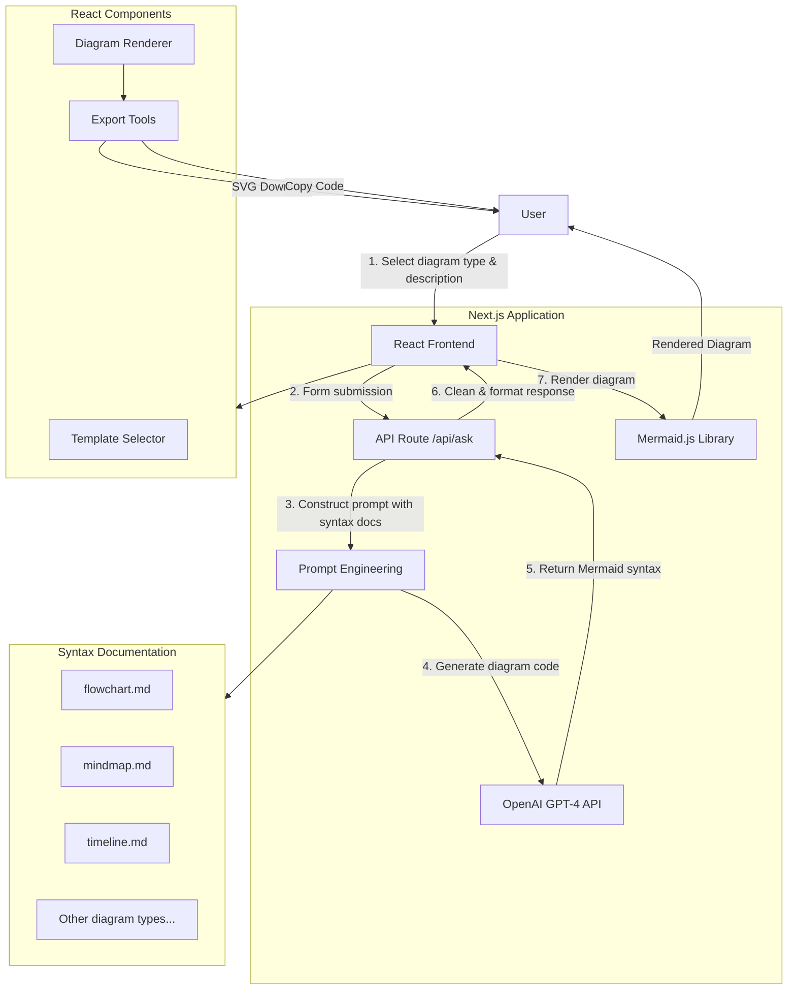

# Diagram Generator Tool

## Agents / Agentic Workflows Name

- **Diagram Generator**: A single AI-powered service that converts natural language descriptions into Mermaid diagram syntax

## Agent / Workflow Description

This is a Next.js web application that generates various types of diagrams using OpenAI's GPT-4o model. It's **not a multi-agent system** but rather a simple agent with the following workflow:

1. **User Input**: User selects diagram type (flowchart, mindmap, timeline, etc.) and provides a description
2. **Prompt Engineering**: The application constructs specific prompts based on the selected diagram type, incorporating syntax documentation
3. **AI Generation**: Sends the prompt to OpenAI's GPT-4 API to generate Mermaid syntax code
4. **Rendering**: Uses Mermaid.js library to render the generated diagram code
5. **Export**: Provides options to export as SVG or copy the Mermaid code

## Domain / Industry

**Diagramming and Visualization Tools**

## Tools / Functions Used By Agents

### Diagram Generator:
- `OpenAI GPT-4o API`: Generates Mermaid syntax from natural language descriptions
- `Mermaid.js`: Renders diagrams from generated syntax
- `Template System`: Uses predefined syntax documentation for different diagram types
- `Export Functions`: SVG export and code copying capabilities

### Supported Diagram Types:
- Flowcharts
- Mindmaps  
- Timelines
- User Journey Maps
- Class Diagrams
- Kanban Boards
- Entity Relationship Diagrams
- Sequence Diagrams
- State Diagrams
- Gantt Charts
- Quadrant Charts
- Sankey Diagrams
- Architecture Diagrams

## Architecture Design

**Important Note**: This is a **single-purpose AI agent**, not an agentic system. It uses OpenAI as an external service to generate diagram code, but doesn't implement multi-agent orchestration, multi-step reasoning, or agent collaboration patterns typical of agentic frameworks.