# PR-Agent

## Agents / Agentic Workflows Name

PR-Agent is a framework composed of an orchestrator and several specialized tools (agents) that assist in various aspects of the pull request lifecycle.

-   **PR-Agent Orchestrator (`PRAgent` class):** Receives commands/events from various entry points (CLI, GitHub Actions, Webhooks) and routes them to the appropriate specialized tool/agent.
-   **Describe Tool (PR Description Agent - `PRDescription` class):** Automatically generates a PR title, type (e.g., Bug fix, Feature), summary, a detailed code walkthrough of changes, and relevant labels.
-   **Review Tool (PR Review Agent - `PRReviewer` class):** Provides an AI-generated review of the PR, highlighting potential issues, security concerns, estimating review effort, and checking for tests and ticket compliance.
-   **Improve Tool (Code Suggestions Agent - `PRCodeSuggestions` class):** Scans PR code changes and suggests specific code improvements, often with committable diffs. Includes self-reflection capabilities.
-   **Ask Tool (Question Answering Agent - `PRQuestions` class):** Answers free-text questions about the PR code, changes, or context.
    -   **Ask Line Tool (`PR_LineQuestions` class):** Answers questions about specific lines of code within the PR.
-   **Update Changelog Tool (`PRUpdateChangelog` class):** Automatically updates the `CHANGELOG.md` file based on the PR's changes.
-   **Help Docs Tool (`PRHelpDocs` class):** Answers free-text questions based on a specified documentation folder within a repository.
-   **Add Docs Tool (Documentation Agent - `PRAddDocs` class) 💎:** Generates documentation (e.g., docstrings) for new or modified code components in the PR.
-   **Generate Labels Tool (Custom Labels Agent - `PRGenerateLabels` class) 💎:** Suggests custom labels for the PR based on its content and user-defined label descriptions.
-   **Analyze Tool (PR Analysis Agent) 💎:** Scans PR changes, identifies modified code components (methods, functions, classes), and allows interactive generation of tests, documentation, and code suggestions for each component. Also facilitates finding similar code.
-   **Test Tool (Test Generation Agent - `PRTest` class) 💎:** Generates unit tests for selected code components based on PR changes.
-   **Custom Prompt Tool (`PRCustomPrompt` class) 💎:** Generates code suggestions based on a user-defined custom prompt, allowing for highly tailored feedback.
-   **Improve Component Tool (`PRImproveComponent` class) 💎:** Generates code suggestions specifically for a chosen code component that was changed in the PR.
-   **CI Feedback Tool (`PRCIFeedback` class) 💎:** Analyzes failed CI/CD job logs and provides feedback or suggestions.
-   **Implement Tool (`PRImplement` class) 💎:** Converts human code review discussions and feedback into ready-to-commit code changes.
-   **Scan Repo Discussions Tool (`PRScanRepoDiscussions` class) 💎:** Analyzes past PR discussions to generate a `best_practices.md` file, capturing repository-specific coding patterns and review feedback.
-   **Similar Issue Tool (`PRSimilarIssue` class):** Retrieves and lists issues similar to the current one from the repository, using vector embeddings.
-   **Help Tool (`PRHelpMessage` class):** Provides a list of available tools and their descriptions.
-   **Config Tool (`PRConfig` class):** Displays the current PR-Agent configuration settings.

## Agent / Workflow Description

PR-Agent is an AI-powered tool designed to automate and enhance the pull request (PR) review and management process across various Git platforms (GitHub, GitLab, Bitbucket, Azure DevOps, etc.). It operates through a set of specialized tools, each acting as an agent focused on a specific task like describing PR changes, reviewing code, suggesting improvements, or answering questions.

The general workflow is as follows:
1.  **Invocation:** A PR-Agent tool is invoked either manually (e.g., by a user commenting `/review` on a PR, or via CLI) or automatically (e.g., when a new PR is opened, via GitHub Actions, or webhooks).
2.  **Orchestration:** The central `PRAgent` orchestrator receives the command or event. It parses the request and routes it to the appropriate specialized tool/agent (e.g., `PRReviewer` for a `/review` command).
3.  **Context Gathering:** The selected tool interacts with a `GitProvider` (e.g., `GithubProvider`) to fetch relevant data from the Git platform. This includes PR diffs, title, description, commit messages, existing comments, and file contents.
4.  **Core Abilities & Processing:** The tool may utilize several "Core Abilities" to process the gathered information:
    *   **PR Compression:** Compresses large PR diffs to fit within LLM token limits.
    *   **Dynamic Context:** Expands context around code changes dynamically based on code structure.
    *   **Ticket Context Fetching:** Retrieves information from linked Jira or GitHub issues.
    *   **RAG Context Enrichment (💎):** Uses Retrieval-Augmented Generation by searching the codebase for relevant code segments.
    *   **Static Code Analysis (💎):** Parses code to understand components for tools like `/analyze`.
    *   **Metadata Injection:** Uses AI-generated summaries from one tool (e.g., `/describe`) as input for another.
5.  **AI Interaction:** The tool, using a `TokenHandler` to manage token limits, constructs a prompt (system and user messages) based on the processed PR data and tool-specific instructions. It then sends this prompt to an `AIHandler` (typically `LiteLLMAIHandler`), which communicates with a configured Large Language Model (LLM) like OpenAI's GPT series, Anthropic's Claude, or others.
6.  **Response Processing & Self-Reflection:** The LLM's response is received. Some tools, like `/improve`, may employ a self-reflection step where the LLM evaluates its own suggestions for quality and relevance.
7.  **Output Generation:** The tool formats the AI's (potentially self-reflected) response into a human-readable format, usually Markdown. This could be a PR review, a new PR description, code suggestions, answers to questions, etc.
8.  **Publication:** The `GitProvider` is used to publish the generated output back to the Git platform. This can involve posting a comment, updating the PR description, adding labels, or suggesting code changes directly.

Qodo Merge is the hosted version of PR-Agent, offering additional features, managed services, and enhanced privacy options.

## Domain / Industry

-   Software Development
-   DevOps
-   Code Review Automation
-   Pull Request Management

## Tools / Functions Used By Agents

### PR-Agent Orchestrator (`PRAgent` class):
-   **Purpose:** Central command and event handler.
-   **Functions/Tools Used:**
    -   `handle_request(pr_url, request_str)`: Parses input and routes to the appropriate tool.
    -   Manages interaction with `GitProvider` for initial setup and `AIHandler`.
    -   Uses `ConfigLoader` to apply repository-specific and global settings.

### Describe Tool (PR Description Agent - `PRDescription`):
-   **Purpose:** Generates PR title, type, summary, code walkthrough, and labels.
-   **Functions/Tools Used:**
    -   `GitProvider`: To fetch PR diff, user description, commit messages. To publish updated description and labels.
    -   `AIHandler (LiteLLM)`: For LLM calls to generate description components.
    -   `(Optional) TicketContextFetcher`: To enrich context from linked issues.
    -   `TokenHandler`: Manages LLM token limits for diffs and prompts.
    -   Core Abilities: PR Compression, Custom Labels logic.

### Review Tool (PR Review Agent - `PRReviewer`):
-   **Purpose:** Provides comprehensive AI-generated PR reviews.
-   **Functions/Tools Used:**
    -   `GitProvider`: To fetch PR diff, description, commit messages, existing comments (for answering questions). To publish review comments and labels.
    -   `AIHandler (LiteLLM)`: For LLM calls to generate review sections (issues, security, effort, etc.).
    -   `(Optional) TicketContextFetcher`: For ticket compliance checks.
    -   `TokenHandler`: Manages LLM token limits.
    -   Core Abilities: PR Compression, Custom Labels logic (for review-specific labels like effort/security).

### Improve Tool (Code Suggestions Agent - `PRCodeSuggestions`):
-   **Purpose:** Generates actionable code improvement suggestions.
-   **Functions/Tools Used:**
    -   `GitProvider`: To fetch PR diff. To publish code suggestions as inline comments or a summary table.
    -   `AIHandler (LiteLLM)`: For LLM calls to generate code suggestions and for self-reflection on those suggestions.
    -   `TokenHandler`: Manages LLM token limits.
    -   Core Abilities: PR Compression, Dynamic Context, Self-Reflection, Code Validation (for committable suggestions).
    -   `(Optional) Best Practices Loader`: Reads `best_practices.md` for custom guidelines.
    -   `(Optional) Auto Best Practices (💎)`: Learns from accepted suggestions.

### Ask Tool (Question Answering Agent - `PRQuestions` / `PR_LineQuestions`):
-   **Purpose:** Answers free-text questions about the PR or specific code lines.
-   **Functions/Tools Used:**
    -   `GitProvider`: To fetch PR diff and context. To publish answers as comments.
    -   `AIHandler (LiteLLM)`: For LLM calls to generate answers.
    -   `TokenHandler`: Manages LLM token limits.
    -   Core Abilities: PR Compression (for general PR questions), Hunk Extraction (for line questions).

### Update Changelog Tool (`PRUpdateChangelog`):
-   **Purpose:** Updates `CHANGELOG.md` based on PR content.
-   **Functions/Tools Used:**
    -   `GitProvider`: To fetch PR diff, existing changelog content, and to commit the updated changelog.
    -   `AIHandler (LiteLLM)`: For LLM calls to generate changelog entries.
    -   `TokenHandler`: Manages LLM token limits.

### Add Docs Tool (`PRAddDocs`) 💎:
-   **Purpose:** Generates documentation for code components.
-   **Functions/Tools Used:**
    -   `GitProvider`: To fetch PR diff. To publish documentation suggestions.
    -   `AIHandler (LiteLLM)`: For LLM calls to generate docstrings/comments.
    -   Core Abilities: Static Code Analysis (to identify components).

### Analyze Tool 💎:
-   **Purpose:** Interactive analysis of PR components.
-   **Functions/Tools Used:**
    -   `GitProvider`: To fetch PR diff. To publish analysis and trigger sub-tools.
    -   `AIHandler (LiteLLM)`: For LLM calls related to component understanding.
    -   Invokes other tools (`PRTest`, `PRAddDocs`, `PRImproveComponent`).
    -   Core Abilities: Static Code Analysis.

### Implement Tool (`PRImplement`) 💎:
-   **Purpose:** Converts review feedback into code.
-   **Functions/Tools Used:**
    -   `GitProvider`: To fetch PR diff and review comments. To publish implemented code suggestions.
    -   `AIHandler (LiteLLM)`: For LLM calls to translate natural language feedback into code.
    -   Core Abilities: RAG Context Enrichment (to understand codebase for better implementation).

### Help Docs Tool (`PRHelpDocs`):
-   **Purpose:** Answers questions based on a documentation folder.
-   **Functions/Tools Used:**
    -   `GitProvider`: To clone the repository (if specified) and access documentation files. To publish answers.
    -   `AIHandler (LiteLLM)`: For LLM calls to query documentation content.
    -   File system access: To read documentation files.

### General External Services and Libraries Used by the Framework:
-   **LLM APIs:** OpenAI, Anthropic Claude, Google Gemini/Vertex AI, Cohere, DeepSeek, Mistral, Ollama, etc. (via `LiteLLMAIHandler`).
-   **Git Platform APIs:** GitHub API, GitLab API, Bitbucket API, Azure DevOps API, CodeCommit API, Gitea API, Gerrit API (via specific `GitProvider` implementations).
-   **Ticket System APIs:** Jira API, GitHub Issues API (for ticket context fetching).
-   **Static Analysis Libraries:** `tree-sitter` (for code parsing in tools like Analyze).
-   **Configuration Management:** Dynaconf (for loading `*.toml` settings).
-   **Prompt Templating:** Jinja2.
-   **(Optional) Vector Databases:** Pinecone, LanceDB (for `PRSimilarIssue` tool).
-   **(Optional for Gerrit) Patch Server:** External service for hosting patch files for review.

## Architecture Design

```mermaid
graph TD
    UserRequest["User Request (e.g., /review comment, PR open event)"]

    subgraph EntryPoints ["Entry Points (Interface with Git Platforms)"]
        CLI["CLI (cli.py)"]
        GitHubAction["GitHub Action (github_action_runner.py)"]
        Webhooks["Webhooks (e.g., github_app.py, gitlab_webhook.py)"]
    end

    UserRequest --> EntryPoints

    EntryPointOrchestrator["PR-Agent Orchestrator (PRAgent class)"]

    EntryPoints --> EntryPointOrchestrator

    subgraph ToolsAsAgents ["Specialized Tools / Agents"]
        DescribeAgent["Describe Tool (PRDescription)"]
        ReviewAgent["Review Tool (PRReviewer)"]
        ImproveAgent["Improve Tool (PRCodeSuggestions)"]
        AskAgent["Ask Tool (PRQuestions)"]
        UpdateChangelogAgent["Update Changelog Tool (PRUpdateChangelog)"]
        AddDocsAgent["Add Docs Tool (PRAddDocs) 💎"]
        GenerateLabelsAgent["Generate Labels Tool (PRGenerateLabels) 💎"]
        AnalyzeAgent["Analyze Tool 💎"]
        ImplementAgent["Implement Tool 💎"]
        HelpDocsAgent["Help Docs Tool"]
        MoreTools["... (Other Tools)"]
    end

    EntryPointOrchestrator -->|Routes command to| ToolsAsAgents

    subgraph CoreInfrastructure ["Core Infrastructure & Handlers"]
        ConfigLoader["Configuration Loader (config_loader.py)"]
        TokenHandler["Token Handler (token_handler.py)"]
        GitProviderInterface["Git Provider Interface (git_provider.py)"]
        AIHandlerInterface["AI Handler Interface (LiteLLM)"]
    end

    ToolsAsAgents --> ConfigLoader
    ToolsAsAgents --> TokenHandler
    ToolsAsAgents --> GitProviderInterface
    ToolsAsAgents --> AIHandlerInterface

    subgraph CoreAbilitiesModule ["Core Abilities (pr_agent/algo & docs/core-abilities)"]
        PRCompression["PR Compression"]
        DynamicContext["Dynamic Context"]
        TicketContextFetching["Ticket Context Fetching"]
        RAGContextEnrichment["RAG Context Enrichment 💎"]
        StaticCodeAnalysis["Static Code Analysis 💎"]
        SelfReflection["Self-Reflection (for /improve)"]
    end

    ToolsAsAgents -->|Utilize| CoreAbilitiesModule

    subgraph ExternalServicesAPIs ["External Services & APIs"]
        GitPlatformAPI[("Git Platform API (e.g., GitHub, GitLab)")];
        LLMAPIs[("LLM APIs (e.g., OpenAI, Claude, Gemini via LiteLLM)")];
        TicketSystemAPIs[("Ticket System APIs (e.g., Jira, GitHub Issues)")];
        OptionalVectorDBs[("(Optional) Vector DBs (Pinecone, LanceDB)")];
    end

    GitProviderInterface -->|Interacts with| GitPlatformAPI
    AIHandlerInterface -->|Interacts with| LLMAPIs
    TicketContextFetching -->|Interacts with| TicketSystemAPIs
    CoreAbilitiesModule -- optional RAG --> OptionalVectorDBs

    GitPlatformAPI -->|Webhook Events| Webhooks
    UserResponse["User receives feedback (via PR comments, description updates, etc.)"]
    GitPlatformAPI --> UserResponse
```

The architecture shows how PR-Agent receives requests through various entry points, orchestrates them to specialized tools/agents, which then leverage core infrastructure, abilities, and external services (like LLMs and Git platform APIs) to process the request and deliver AI-powered feedback and actions back to the user via the Git platform. Qodo Merge builds upon this framework with additional enterprise-grade features and hosting.
