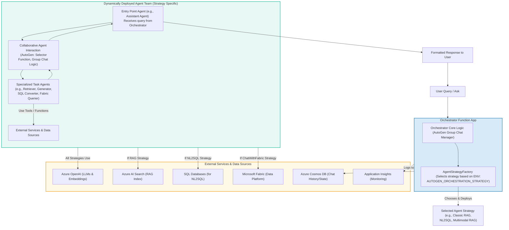

# Enterprise RAG Agentic Orchestrator

## Agents / Agentic Workflows Name
The **Enterprise RAG Agentic Orchestrator** is the central coordinating system. It employs a factory pattern to deploy various agentic workflows, referred to as "Agent Strategies." Key components include:

-   **Core Orchestrator Components**:
    -   **AutoGen Group Chat Manager**: Manages multi-agent conversations using AutoGen's `Selector Group Chat` pattern, based on the active strategy.
    -   **Agent Strategy Factory**: Dynamically creates and configures a team of specialized agents based on the selected strategy (e.g., `classic_rag`, `nl2sql`) specified via the `AUTOGEN_ORCHESTRATION_STRATEGY` environment variable.

-   **Agent Strategies (as distinct, dynamically selected agentic workflows)**:
    -   **Classic RAG Workflow (`classic_rag`)**:
        -   **Orchestrating Assistant Agent**: Processes user queries, coordinates retrieval, and manages response generation.
        -   **(Implicit) Retriever Agent**: Fetches relevant information from a knowledge base indexed in Azure AI Search.
        -   **(Implicit) Generator Agent**: Synthesizes responses using Azure OpenAI, based on the retrieved context.
    -   **Multimodal RAG Workflow (`multimodal_rag`)**:
        -   **Assistant Agent (Multimodal RAG)**: Processes user queries and invokes multimodal retrieval tools.
        -   **Multimodal Retriever Tool**: A function (e.g., `multimodal_vector_index_retrieve`) used by the Assistant Agent to fetch text and image data from a multimodal index.
        -   **Multimodal Message Creator Agent**: Constructs responses that integrate both text and image data.
    -   **NL2SQL Workflow (`nl2sql`)**:
        -   **NL-to-SQL Conversion Agent**: Translates natural language questions into SQL queries, likely using Azure OpenAI.
        -   **SQL Execution Agent**: Executes the generated SQL queries against target Azure SQL databases.
        -   **Results Presentation Agent**: Formats and returns the database query results to the user.
    -   **NL2SQL Fewshot Workflow (`nl2sql_fewshot`)**:
        -   Extends the NL2SQL Workflow.
        -   **Query Example Retriever Agent**: Enhances SQL generation by first searching for and retrieving similar past queries (few-shot examples) to guide the NL-to-SQL Conversion Agent.
    -   **Chat with Fabric Workflow (`chat_with_fabric`)**:
        -   **Fabric Query Formulation Agent**: Converts natural language queries into appropriate queries or API calls for Microsoft Fabric.
        -   **Fabric Data Retrieval Agent**: Interacts with Microsoft Fabric (Lakehouse tables, semantic models) to fetch the requested data.
        -   **Results Presentation Agent**: Formats and presents the data retrieved from Fabric.

## Agent / Workflow Description
The **GPT-RAG Agentic Orchestrator** is a sophisticated system designed to handle complex user queries by coordinating collaboration among multiple specialized AI agents. It is built upon Microsoft's AutoGen framework, specifically utilizing the `Selector Group Chat` pattern to manage dynamic conversations.

**How it Works:**
1.  A user submits a query.
2.  The Orchestrator, typically running as an Azure Function App, receives the query.
3.  The **Agent Strategy Factory** component inspects the `AUTOGEN_ORCHESTRATION_STRATEGY` environment variable to determine which agent strategy to employ.
4.  Based on the selected strategy (e.g., `classic_rag`, `multimodal_rag`, `nl2sql`), the factory instantiates a specific team of agents, each with predefined roles, system messages, and capabilities (tools/functions).
5.  The **AutoGen Group Chat Manager** then facilitates the interaction between these agents. A "Selector Function" within the strategy defines rules for choosing the next agent to speak or act, ensuring a logical flow of conversation and task execution.
6.  Agents collaborate to process the query:
    * For **RAG strategies**, this involves retrieving information from knowledge bases (like Azure AI Search) and generating a response using an LLM.
    * For **NL2SQL strategies**, this involves converting the natural language query to SQL, executing it on a database, and formatting the results.
    * For **Chat with Fabric**, it involves querying Microsoft Fabric data sources.
7.  The final, synthesized response is returned to the user.

The system is designed for extensibility, allowing developers to create and register new custom agent strategies by subclassing `BaseAgentStrategy` and updating the `AgentStrategyFactory`.

## Domain / Industry
-   Enterprise Knowledge Management
-   Data Analytics & Business Intelligence
-   General purpose question-answering over private data sources
-   Multimodal data interaction

## Tools / Functions Used By Agents

-   **Core Framework**:
    -   **AutoGen**:
        -   `AgentChat` programming framework.
        -   `Selector Group Chat` pattern for multi-agent coordination.
        -   `AssistantAgent` (base for various orchestrating agents).
        -   Selector Function (defines agent transition rules within a strategy).
-   **Orchestration & Strategy Management**:
    -   `AgentStrategyFactory`: Creates agent teams based on selected strategy.
    -   `BaseAgentStrategy`: Base class for defining custom strategies.
-   **Azure Services**:
    -   **Azure OpenAI Service**:
        -   Large Language Models (e.g., `gpt-4o`) for natural language understanding, generation, SQL conversion, and agent reasoning.
        -   Embedding Models (e.g., `text-embedding-3-large`) for RAG indexing and retrieval.
    -   **Azure AI Search**:
        -   Knowledge base for `classic_rag` and `multimodal_rag` strategies.
        -   Supports vector search, hybrid search, and semantic search.
    -   **Azure Cosmos DB**: Inferred for storing conversation history, agent state, or user data (based on `AZURE_DB_ID`, `AZURE_DB_NAME` variables).
    -   **Azure SQL Databases**: Target databases for `nl2sql` and `nl2sql_fewshot` strategies.
    -   **Microsoft Fabric**: Target data platform for the `chat_with_fabric` strategy (Lakehouse, semantic models).
    -   **Azure Key Vault**: For secure management of secrets like API keys.
    -   **Azure Storage Account**: Stores documents for RAG indexing.
    -   **Application Insights**: For telemetry, logging, and monitoring of the orchestrator.
    -   **Azure Function App**: Typical deployment environment for the orchestrator.
-   **Specific Tools/Functions within Strategies**:
    -   `multimodal_rag` strategy:
        -   `multimodal_vector_index_retrieve`: Tool function called by the Assistant Agent to fetch multimodal data.
        -   `MultiModalMessage` construction: Logic within the Multimodal Message Creator agent.
    -   Data retrieval from Azure AI Search (vector, semantic, keyword).
    -   SQL query execution against databases.
    -   Microsoft Fabric data querying.
-   **Development & Deployment**:
    -   Azure Developer CLI (`azd`)
    -   Azure Functions Core Tools (`func`)

## Architecture Design

**Diagram Explanation:**
The user's query is processed by the **Enterprise RAG Agentic Orchestrator**, typically hosted in an Azure Function App. Inside the orchestrator, the **AgentStrategyFactory** selects an appropriate agent strategy (e.g., Classic RAG, NL2SQL) based on configuration. This chosen strategy deploys a specific **Agent Team** managed by AutoGen's group chat and selector functions. These agents collaborate, using tools and functions that interact with various **External Services** like Azure OpenAI (for LLM tasks), Azure AI Search (for RAG), SQL Databases, or Microsoft Fabric, depending on the strategy. The orchestrator also uses Azure Cosmos DB for state/history and Application Insights for monitoring. Finally, a formatted response is returned to the user.
