# AIDA - AI Insights Data Analysis Assistant

## Agents / Agentic Workflows Name

- **Data Summarizer Agent**: Analyzes and summarizes uploaded datasets
- **Goal Explorer Agent**: Generates visualization goals based on data and personas
- **Persona Explorer Agent**: Creates data-focused personas to guide analysis
- **Visualization Generator Agent**: Creates visualization code from natural language queries
- **Visualization Editor Agent**: Modifies existing visualizations based on instructions
- **Visualization Explainer Agent**: Provides detailed explanations of visualization code
- **Visualization Evaluator Agent**: Evaluates visualizations across multiple quality dimensions
- **Visualization Repairer Agent**: Fixes visualization code based on feedback
- **Visualization Recommender Agent**: Suggests related visualizations
- **Chart Executor Agent**: Executes visualization code and generates charts
- **Infographer Agent**: Creates infographics from visualizations using AI image generation

## Agent / Workflow Description

This is an AI-powered data analysis and visualization platform that orchestrates multiple specialized agents to help users understand and visualize their data:

1. The **Data Summarizer Agent** processes uploaded CSV, Excel, or JSON files and creates comprehensive summaries including field types, descriptions, and semantic information
2. The **Persona Explorer Agent** generates relevant personas (e.g., CEO, analyst, researcher) based on the dataset to guide targeted analysis
3. The **Goal Explorer Agent** creates visualization objectives tailored to specific personas and data characteristics
4. The **Visualization Generator Agent** converts natural language requests into executable visualization code using multiple libraries (matplotlib, seaborn, altair, plotly)
5. The **Visualization Editor Agent** modifies existing charts based on user instructions
6. The **Visualization Explainer Agent** breaks down visualization code into understandable sections
7. The **Visualization Evaluator Agent** assesses charts across six dimensions: bugs, data transformation, goal compliance, visualization type appropriateness, data encoding, and aesthetics
8. The **Visualization Repairer Agent** fixes code issues based on evaluation feedback
9. The **Visualization Recommender Agent** suggests diverse alternative visualizations
10. The **Chart Executor Agent** runs the code and generates interactive or raster visualizations
11. The **Infographer Agent** creates stylized infographics using stable diffusion models

## Domain / Industry

Data Analytics and Business Intelligence

## Tools / Functions Used By Agents

### Data Summarizer Agent:
- `summarize`: Analyzes dataset structure and generates field descriptions
- `get_column_properties`: Extracts data types, statistics, and sample values
- `enrich`: Uses LLM to add semantic descriptions and field classifications

### Goal Explorer Agent:
- `generate`: Creates visualization goals based on data summary and persona
- Produces structured goals with questions, visualization types, and rationales

### Persona Explorer Agent:
- `generate`: Creates data-relevant personas with descriptions and rationales

### Visualization Generator Agent:
- `generate`: Converts goals and data summaries into executable visualization code
- Supports multiple libraries: matplotlib, seaborn, altair, plotly, ggplot

### Visualization Editor Agent:
- `generate`: Modifies existing visualization code based on user instructions

### Visualization Explainer Agent:
- `generate`: Provides structured explanations covering accessibility, transformation, and visualization aspects

### Visualization Evaluator Agent:
- `generate`: Evaluates code across six quality dimensions with scores and rationales

### Visualization Repairer Agent:
- `generate`: Fixes visualization code based on evaluation feedback

### Visualization Recommender Agent:
- `generate`: Suggests diverse alternative visualizations based on existing code

### Chart Executor Agent:
- `execute`: Runs visualization code and generates charts in multiple formats
- `preprocess_code`: Cleans and prepares code for execution
- `get_globals_dict`: Sets up execution environment with necessary imports

### Infographer Agent:
- `generate`: Creates stylized infographics using stable diffusion models
- `load_model`: Initializes image generation models

## Architecture Design

```mermaid
graph TD
    User[User] -->|Upload Data| WebUI[React Web Interface]
    WebUI -->|API Requests| FastAPI[FastAPI Backend]
    
    subgraph "Agent Manager System"
        FastAPI -->|Orchestrates| Manager[Manager Class]
        Manager -->|Text Generation| LiteLLM[LiteLLM TextGenerator]
        
        subgraph "Data Processing Agents"
            Manager -->|File Analysis| Summarizer[Data Summarizer Agent]
            Manager -->|Persona Creation| PersonaExplorer[Persona Explorer Agent]
            Manager -->|Goal Generation| GoalExplorer[Goal Explorer Agent]
        end
        
        subgraph "Visualization Agents"
            Manager -->|Code Generation| VizGenerator[Visualization Generator Agent]
            Manager -->|Code Editing| VizEditor[Visualization Editor Agent]
            Manager -->|Code Explanation| VizExplainer[Visualization Explainer Agent]
            Manager -->|Quality Assessment| VizEvaluator[Visualization Evaluator Agent]
            Manager -->|Code Repair| VizRepairer[Visualization Repairer Agent]
            Manager -->|Recommendations| VizRecommender[Visualization Recommender Agent]
        end
        
        subgraph "Execution & Enhancement"
            Manager -->|Chart Generation| ChartExecutor[Chart Executor Agent]
            Manager -->|Infographic Creation| Infographer[Infographer Agent]
        end
    end
    
    subgraph "LLM Providers"
        LiteLLM -->|API Calls| OpenAI[OpenAI GPT Models]
        LiteLLM -->|API Calls| Azure[Azure OpenAI]
        LiteLLM -->|API Calls| Anthropic[Anthropic Claude]
        LiteLLM -->|API Calls| Google[Google Gemini]
        LiteLLM -->|API Calls| Ollama[Ollama Local Models]
    end
    
    subgraph "Visualization Libraries"
        ChartExecutor -->|Generates| Matplotlib[Matplotlib Charts]
        ChartExecutor -->|Generates| Seaborn[Seaborn Charts]
        ChartExecutor -->|Generates| Altair[Altair/Vega-Lite]
        ChartExecutor -->|Generates| Plotly[Plotly Interactive]
        ChartExecutor -->|Generates| GGPlot[ggplot Style]
    end
    
    subgraph "AI Image Generation"
        Infographer -->|Style Transfer| StableDiffusion[Stable Diffusion Models]
    end
    
    subgraph "Data Storage"
        FastAPI -->|File Storage| DataFolder[Data Files Storage]
        FastAPI -->|Static Assets| StaticFiles[Static File Server]
    end
    
    Manager -->|Results| FastAPI
    FastAPI -->|JSON Response| WebUI
    WebUI -->|Interactive Charts| User
    
    ChartExecutor -->|Base64 Images| WebUI
    ChartExecutor -->|Vega-Lite Specs| WebUI
    Infographer -->|Styled Images| WebUI
```

The architecture demonstrates a comprehensive multi-agent system for data analysis and visualization. The Manager class orchestrates all agents, using LiteLLM for flexible LLM provider support. Agents work collaboratively: the Data Summarizer processes uploads, Persona and Goal agents guide analysis direction, Visualization agents handle code generation and quality assurance, while the Executor generates final charts. The system supports multiple visualization libraries and includes advanced features like AI-powered infographic generation. The React frontend provides an intuitive interface for users to interact with the sophisticated backend agent ecosystem.
