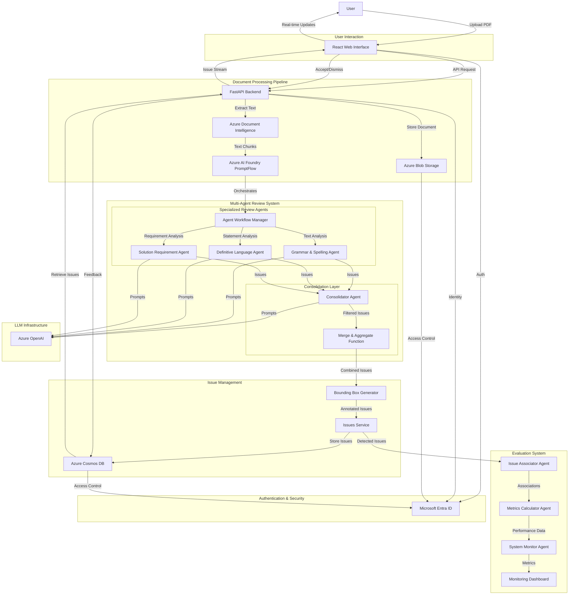

# AI Document Review Assistant

## Agents / Agentic Workflows Name

- **Grammar & Spelling Agent**: Reviews documents for grammatical errors, spelling mistakes, and language accuracy
- **Definitive Language Agent**: Identifies overly definitive or absolute statements that could create unrealistic expectations
- **Solution Requirement Agent**: Ensures client requirements are properly addressed with clear, specific solutions
- **Consolidator Agent**: Analyzes and consolidates comments from expert reviewers for final approval
- **Issue Associator Agent**: Associates detected issues with ground truth issues for evaluation
- **Metrics Calculator Agent**: Calculates precision, recall, and other performance metrics
- **System Monitor Agent**: Tracks system-wide metrics like acceptance rates and document review statistics

## Agent / Workflow Description

This is an AI-powered document review system that orchestrates multiple specialized agents to analyze documents for compliance and accuracy across various domains:

1. The **Grammar & Spelling Agent** meticulously reviews documents for grammatical and spelling accuracy in American English, focusing on verb tense accuracy, subject-verb agreement, pronoun usage, and spelling corrections
2. The **Definitive Language Agent** specializes in analyzing software development and consulting proposals to identify overly definitive statements about project outcomes, timelines, or capabilities that could create legal exposure
3. The **Solution Requirement Agent** ensures that every client requirement is properly addressed with clear, specific solutions, checking for requirement coverage and implementation details
4. The **Consolidator Agent** acts as a team leader that analyzes, consolidates, and evaluates comments from expert reviewers, filtering important corrections and assigning criticality scores
5. The **Issue Associator Agent** performs evaluation by matching detected issues with ground truth issues based on text similarity for performance assessment
6. The **Metrics Calculator Agent** computes precision, recall, and other evaluation metrics across different issue types
7. The **System Monitor Agent** tracks acceptance rates, suggestion approval rates, and document review statistics

The system uses Azure AI Foundry with PromptFlow for orchestration, allowing agents to work in parallel on document chunks and then consolidate results for comprehensive document analysis.

## Domain / Industry

Document Compliance and Quality Assurance (Legal, Technical, Business Proposals)

## Tools / Functions Used By Agents

### Grammar & Spelling Agent:
- Text analysis for grammatical errors and spelling mistakes
- American English language validation
- Verb tense accuracy checking
- Subject-verb agreement validation
- Pronoun usage analysis
- Article and preposition validation

### Definitive Language Agent:
- Performance and scalability claims analysis
- Security and availability guarantee detection
- Integration complexity assessment
- Cost prediction statement review
- Project timeline commitment analysis

### Solution Requirement Agent:
- Requirements coverage analysis
- Solution detail validation
- Technical precision checking
- Implementation detail verification
- Measurable outcomes assessment

### Consolidator Agent:
- Expert comment analysis and consolidation
- Criticality scoring (0-10 scale)
- Suggested action determination (KEEP/REMOVE)
- Comment filtering and deduplication

### Issue Associator Agent:
- `associate_issues`: Matches detected issues with ground truth using text similarity
- `similarity_ratio`: Calculates similarity between text snippets
- `get_associations`: Returns matched issue pairs
- `get_unassociated_model_output`: Returns false positives
- `get_unassociated_ground_truth`: Returns false negatives

### Metrics Calculator Agent:
- `calculate_precision_per_type`: Computes precision metrics by issue type
- `calculate_recall_per_type`: Computes recall metrics by issue type
- `calculate_false_positives_per_type`: Counts false positives by category
- `calculate_true_positives_per_type`: Counts true positives by category
- `write_metrics_to_promptflow_per_type`: Logs metrics to dashboard

### System Monitor Agent:
- `calculate_acceptance_rate`: Tracks issue acceptance rates
- `calculate_suggestion_approval_rate`: Measures suggestion modification rates
- `calculate_amount_of_unique_document_reviewed`: Counts unique documents processed
- `calculate_issue_type_distribution`: Analyzes distribution of issue types

### Supporting Infrastructure:
- **Document Intelligence**: Text extraction and OCR capabilities
- **Azure Cosmos DB**: Issue storage and retrieval
- **Azure Blob Storage**: Document storage and management
- **PromptFlow**: Agent orchestration and workflow management

## Architecture Design

The architecture demonstrates a sophisticated multi-agent document review system built on Azure services. The system processes documents through specialized review agents that work in parallel, with a consolidation layer that filters and prioritizes issues. The evaluation system provides continuous feedback on agent performance, while the user interface allows for interactive review and feedback collection. The entire system is secured through Microsoft Entra ID and uses Azure's managed services for scalability and reliability.
