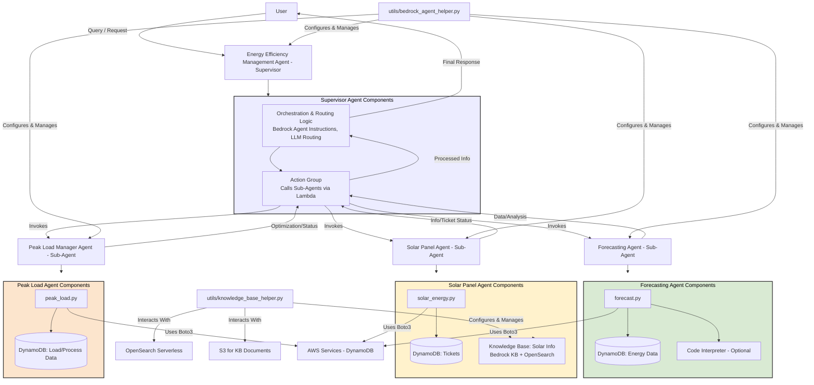

# Energy Efficiency Management System (Multi-Agent Collaboration)

## Agents / Agentic Workflows Name

This system employs a **Supervisor Agent** (referred to as the "Energy Efficiency Management Agent") that orchestrates three specialized **Sub-Agents**. The `utils/bedrock_agent_helper.py` script provides the foundational Python framework for creating, configuring, deploying, and invoking these Amazon Bedrock agents.

-   **Energy Efficiency Management Agent (Supervisor Agent)**:
    -   Acts as the central coordinator. It receives user queries related to energy efficiency and management.
    -   Based on its instructions and potentially a routing model (e.g., Claude 3 Haiku, as configurable via `bedrock_agent_helper.py`), it delegates tasks to the appropriate sub-agent or consults a knowledge base.
    -   It is designed to maintain a seamless interaction with the user, abstracting the underlying sub-agent collaboration.
    -   Its creation and management are handled by functions like `AgentsForAmazonBedrock.create_supervisor_agent()` or `AgentsForAmazonBedrock.create_agent()` with collaboration features enabled within the helper script.

-   **Forecasting Agent (Sub-Agent)**:
    -   Specializes in providing energy consumption data, generating forecasts, and delivering usage statistics.
    -   Its actions are executed via an AWS Lambda function (defined in `1-energy-forecast/forecast.py`).
    -   Can be configured with Amazon Bedrock's Code Interpreter capability for on-the-fly data analysis, managed via `bedrock_agent_helper.py`.

-   **Solar Panel Agent (Sub-Agent)**:
    -   Handles inquiries concerning solar panel installation guidelines, maintenance procedures, and customer support ticketing.
    -   Actions related to support tickets (creation, status check) are managed by an AWS Lambda function (defined in `2-solar-panel/solar_energy.py`).
    -   Likely utilizes an associated Amazon Bedrock Knowledge Base for providing informational content (e.g., guidelines, instructions). This Knowledge Base is set up and managed using helper scripts like `utils/knowledge_base_helper.py` and `utils/knowledge_base.py`.

-   **Peak Load Manager Agent (Sub-Agent)**:
    -   Focuses on identifying non-essential energy-consuming processes, analyzing peak vs. off-peak usage patterns, and optimizing energy grid allocation for customers.
    -   Its actions are performed by an AWS Lambda function (defined in `3-peak-load-manager/peak_load.py`).

## Agent / Workflow Description

The Energy Efficiency Management System streamlines user interactions for energy-related tasks through a hierarchical multi-agent architecture:

1.  A **User** initiates a query or request to the main **Energy Efficiency Management Agent (Supervisor)**.
2.  The **Supervisor Agent** analyzes the user's input. Using its pre-defined instructions and potentially an internal routing mechanism (which can be a sophisticated model like Claude 3 Haiku as suggested by the `ROUTER_MODEL` constant in `bedrock_agent_helper.py`), it decides which sub-agent is best equipped to handle the specific request.
3.  **Task Delegation to Sub-Agents**:
    * **Forecasting**: For queries about energy forecasts, historical consumption, or usage statistics, the task is routed to the **Forecasting Agent**. This agent leverages its Lambda function to interact with a DynamoDB table. If Code Interpreter is enabled for this agent (via `bedrock_agent_helper.py`), it can also perform complex data analysis.
    * **Solar Panel Info & Support**: If the query pertains to solar panel installation, maintenance, or support tickets, the **Solar Panel Agent** is invoked. It may consult its dedicated Knowledge Base (for FAQs, guidelines) or use its Lambda function to manage support tickets stored in DynamoDB.
    * **Peak Load Management**: For requests related to detecting peak energy usage, identifying non-essential processes, or reallocating energy quotas, the **Peak Load Manager Agent** is tasked. It uses its Lambda function for DynamoDB interactions.
4.  **Action Execution & Response**: Each sub-agent, through its AWS Lambda function (and potentially its Knowledge Base or Code Interpreter), performs the necessary actions. This often involves CRUD (Create, Read, Update, Delete) operations on specific DynamoDB tables. The sub-agent then returns its findings or the status of the action to the Supervisor.
5.  The **Supervisor Agent** receives the response(s) from the sub-agent(s), synthesizes the information if necessary, and formulates a coherent final answer for the user. It aims to present this as if it handled the entire request itself.
6.  The entire lifecycle of these agents (creation, IAM roles, Lambda deployment for action groups, KB association, invocation logic, and trace handling) is facilitated by the `AgentsForAmazonBedrock` class in `utils/bedrock_agent_helper.py` and associated knowledge base utilities.

## Domain / Industry
-   Energy Management & Utilities
-   Customer Support (for energy services)
-   Renewable Energy Solutions (Solar Panel Support)
-   Smart Grid & Load Balancing
-   Data Analytics and Forecasting

## Tools / Functions Used By Agents

### Energy Efficiency Management Agent (Supervisor):
-   **Core Logic**: `AgentsForAmazonBedrock.invoke()` (in `bedrock_agent_helper.py`) to call sub-agents.
-   **Setup**: `AgentsForAmazonBedrock.create_supervisor_agent()` or `create_agent()` with collaboration features.
-   **Routing**: May use a specified LLM (e.g., `anthropic.claude-3-haiku-20240307-v1:0`) as a **Routing Classifier Model** for advanced decision-making on which sub-agent to query (configured in `bedrock_agent_helper.py`).
-   **Action Group**: Likely has an action group (`supervisor_agent_function.py` mentioned in `create_supervisor_agent`) that defines how it calls sub-agents.

### Forecasting Agent (Sub-Agent):
    -   **Lambda Function** (`1-energy-forecast/forecast.py`):
        -   `get_forecasted_consumption(customer_id)`: Retrieves forecasted energy data.
        -   `get_historical_consumption(customer_id)`: Retrieves historical energy data.
        -   `get_consumption_statistics(customer_id)`: Fetches energy usage statistics.
        -   `update_forecasting(customer_id, month, year, usage)`: Updates energy forecast entries.
    -   **Data Store**: Amazon DynamoDB (for storing and retrieving consumption and forecast data).
    -   **(Optional) Amazon Bedrock Code Interpreter**: Enabled via `bedrock_agent_helper.py` (`add_code_interpreter`) for dynamic data analysis.
    -   **Tool**: AWS SDK for Python (Boto3) for DynamoDB operations.

### Solar Panel Agent (Sub-Agent):
    -   **Lambda Function** (`2-solar-panel/solar_energy.py`):
        -   `open_ticket(customer_id, msg)`: Creates customer support tickets.
        -   `get_ticket_status(customer_id, ticket_id)`: Checks the status of support tickets.
    -   **Knowledge Base**: Amazon Bedrock Knowledge Base (setup via `utils/knowledge_base_helper.py` and `utils/knowledge_base.py`) for information retrieval on installation and maintenance.
        -   `KnowledgeBasesForAmazonBedrock.create_or_retrieve_knowledge_base()`
        -   `KnowledgeBasesForAmazonBedrock.synchronize_data()`
    -   **Data Store**: Amazon DynamoDB (for ticketing system).
    -   **Tool**: AWS SDK for Python (Boto3).

### Peak Load Manager Agent (Sub-Agent):
    -   **Lambda Function** (`3-peak-load-manager/peak_load.py`):
        -   `detect_peak(customer_id)`: Identifies peak load conditions for a customer.
        -   `detect_non_essential_processes(customer_id)`: Lists processes that can be deferred.
        -   `redistribute_allocation(customer_id, item_id, quota)`: Modifies energy allocations.
    -   **Data Store**: Amazon DynamoDB (for load management parameters and process details).
    -   **Tool**: AWS SDK for Python (Boto3).

### General Framework Tools (from `utils/bedrock_agent_helper.py` and `utils/knowledge_base_helper.py`):
-   **Amazon Bedrock Agent Service**: Core service for defining agent behavior, instructions, models, action groups, and orchestrating calls.
-   **AWS Lambda**: Execution environment for the Python code defining each agent's specific actions (tools).
-   **AWS IAM**: Manages roles and permissions required for Bedrock agents, Lambda functions, and access to other AWS services like S3 and DynamoDB.
-   **Amazon S3**: Used for storing documents for Knowledge Bases or files generated/used by the Code Interpreter.
-   **Amazon DynamoDB**: Serves as the primary persistent data storage for all three sub-agents.
-   **Amazon OpenSearch Serverless**: Utilized as the vector store backing the Bedrock Knowledge Bases.
-   **Python `json`, `boto3`, `time`, `uuid` libraries**: Standard libraries used within the helper scripts and Lambda functions for data manipulation, AWS service interaction, and utility functions.

## Architecture Design

This system demonstrates a robust multi-agent collaboration pattern where a supervisor agent intelligently delegates tasks to specialized sub-agents, each equipped with its own tools (Lambda functions, Knowledge Bases, Code Interpreter) to address specific aspects of energy efficiency management. The `utils` directory provides the necessary framework code to build, deploy, and operate these agents on Amazon Bedrock.
