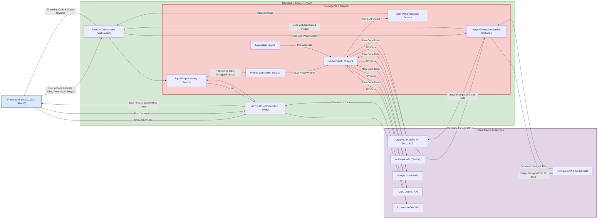

# UI Design Ideation Generation AI Agent

## Agents / Agentic Workflows Name
-   **UI Interaction Layer (Frontend Agent):** Handles user inputs (image/video uploads, URLs, text instructions, code import), settings configuration, and renders previews and generated code.
-   **Request Orchestrator (Backend WebSocket Handler):** Manages the overall code generation workflow, API key handling, and streams data between frontend and backend services.
-   **Input Preprocessing Service (Backend Agent):**
    -   **Screenshot Service:** Captures screenshots from URLs.
    -   **Video Processing Service:** Extracts frames from video inputs.
    -   **Image Optimization Service:** Processes images to meet LLM input requirements.
-   **Prompt Generation Service (Backend Agent):** Constructs tailored prompts for LLMs based on inputs, target stack, and user instructions.
-   **Multimodal LLM Agent (Backend LLM Interaction Service):** Interfaces with various large language models (OpenAI GPT-4o, Anthropic Claude, Google Gemini, Azure OpenAI) to generate code based on prompts.
-   **Code Postprocessing Service (Backend Agent):** Extracts and cleans the raw code output from LLMs.
-   **Image Generation Service (Backend Agent - Optional):** Generates images from textual descriptions (alt text of placeholders) using models like DALL-E 3 or Flux Schnell.
-   **Evaluation Engine (Backend Agent):** Provides tools for running and managing evaluations of the generated code across different models and stacks.
-   **File System Logger (Backend Utility):** Logs prompts and completions for debugging and analysis.
-   **Debug Artifact Writer (Backend Utility):** Saves intermediate artifacts during processing if debug mode is enabled.

## Agent / Workflow Description
This system, "screenshot-to-code," converts visual inputs (screenshots, mockups, Figma designs, or even screen recordings) into functional code for various web development stacks. The workflow is orchestrated primarily through a WebSocket connection between the frontend UI and the backend.

1.  **Input Acquisition (UI Interaction Layer & Input Preprocessing Service):**
    * The user provides input via the frontend: uploading an image/video, pasting a URL (which the `Screenshot Service` captures), or importing existing code.
    * For video inputs, the `Video Processing Service` extracts frames.
    * The `Image Optimization Service` processes images to ensure compatibility with the selected LLM (e.g., resizing for Claude).

2.  **Prompt Construction (Prompt Generation Service):**
    * The backend constructs a detailed prompt for the chosen multimodal LLM. This prompt includes the visual input (image/frames), the target code stack (e.g., HTML/Tailwind, React/Tailwind), any user-provided instructions (for updates), and specific system messages tailored for the task.

3.  **Code Generation (Request Orchestrator & Multimodal LLM Agent):**
    * The `Request Orchestrator` sends the prompt and image(s) to the `Multimodal LLM Agent`.
    * This agent interacts with the selected LLM (e.g., GPT-4o, Claude Sonnet 3.5, Gemini 2.0 Flash, Azure OpenAI model).
    * The LLM streams back the generated code. The orchestrator forwards these code chunks to the UI in real-time. Two variants are typically generated in parallel using different models or configurations.

4.  **Code Refinement (Code Postprocessing Service):**
    * The raw output from the LLM is processed to extract the clean HTML/code block.

5.  **Optional Image Generation (Image Generation Service):**
    * If enabled, the generated code is parsed for placeholder images (e.g., `https://placehold.co` with descriptive alt text).
    * The alt text is used as a prompt to generate actual images using DALL-E 3 or Flux Schnell (via Replicate).
    * These generated image URLs replace the placeholders in the code.

6.  **Output and Iteration (UI Interaction Layer):**
    * The final code (potentially with generated images) is displayed in the frontend preview pane and code editor.
    * The user can then provide further instructions to update the code, regenerate it, or switch between generated variants. This iterative process uses the existing code and new instructions to refine the output.
    * The system supports versioning, allowing users to revert to or branch from previous code states.

7.  **Evaluation (Evaluation Engine):**
    * A separate module allows for running systematic evaluations of the code generation capabilities across different models and stacks, supporting pairwise comparisons and best-of-N scoring.

## Domain / Industry
-   Software Development Tools
-   AI-Powered Code Generation
-   Web Development Automation
-   Developer Productivity

## Tools / Functions Used By Agents

### UI Interaction Layer (Frontend Agent):
-   **Framework/Libraries:** React, Vite, TypeScript, Tailwind CSS, Zustand
-   **Communication:** WebSockets (`frontend/src/generateCode.ts`)
-   **Input Handling:** `react-dropzone` (file uploads), custom URL input logic, screen recording (`navigator.mediaDevices.getDisplayMedia`, `webm-duration-fix`)
-   **Preview/Editing:** Custom iframe rendering, CodeMirror (code editor), `html2canvas` (for screenshotting preview), select-and-edit DOM manipulation.
-   **UI Components:** Shadcn/ui (various components like Dialog, Button, Tabs, etc.)
-   **Notifications:** `react-hot-toast`

### Request Orchestrator (Backend WebSocket Handler):
-   **Framework:** FastAPI (Python)
-   **Concurrency:** `asyncio`
-   **Main Functions:** Manages WebSocket connections (`/generate-code` endpoint in `backend/routes/generate_code.py`), coordinates calls to other services/agents, streams data.

### Input Preprocessing Service (Backend Agent):
-   **Screenshot Service (`backend/routes/screenshot.py`):**
    -   `capture_screenshot`: Uses `httpx` to call ScreenshotOne API.
-   **Video Processing Service (`backend/video/utils.py`):**
    -   `split_video_into_screenshots`: Uses `moviepy` and `Pillow (PIL)`.
    -   `assemble_claude_prompt_video`: Formats frames for Claude.
-   **Image Optimization Service (`backend/image_processing/utils.py`):**
    -   `process_image`: Uses `Pillow (PIL)` for resizing, compression to meet Claude's requirements.

### Prompt Generation Service (Backend Agent):
-   **Location:** `backend/prompts/`
-   **Main Functions:**
    -   `create_prompt`: Assembles prompt based on parameters, stack, and input mode.
    -   `assemble_imported_code_prompt`: Creates prompts for updating existing code.
    -   `assemble_prompt`: Creates prompts for generating code from images.
    -   Utilizes various prompt templates from `claude_prompts.py`, `imported_code_prompts.py`, `screenshot_system_prompts.py`.

### Multimodal LLM Agent (Backend LLM Interaction Service):
-   **Location:** `backend/llm.py`
-   **Main Functions (interacting with LLM SDKs):**
    -   `stream_openai_response`: Uses `openai` Python library (for OpenAI models).
    -   `stream_azure_openai_response`: Uses `openai` Python library (for Azure OpenAI models).
    -   `stream_claude_response`, `stream_claude_response_native`: Uses `anthropic` Python library.
    -   `stream_gemini_response`: Uses `google-generativeai` Python library.
-   **Supported Models (Enum `Llm`):** GPT-4o, GPT-4 Vision, Claude 3 series (Sonnet, Opus, Haiku), Claude 3.5 Sonnet, Gemini 2.0 Flash, Azure OpenAI Deployment.

### Code Postprocessing Service (Backend Agent):
-   **Location:** `backend/codegen/utils.py`
-   **Main Functions:**
    -   `extract_html_content`: Uses `re` (regex) to find and extract HTML content from LLM responses.

### Image Generation Service (Backend Agent - Optional):
-   **Location:** `backend/image_generation/core.py`, `backend/image_generation/replicate.py`
-   **Main Functions:**
    -   `generate_images`: Orchestrates image generation by finding placeholders.
    -   `process_tasks`: Asynchronously calls image generation models.
    -   `generate_image_dalle`: Uses `openai` Python library to call DALL-E 3.
    -   `generate_image_replicate` (calls `call_replicate`): Uses `httpx` to call Replicate API (for Flux Schnell model).
    -   `create_alt_url_mapping`, `extract_dimensions`: Utilities using `BeautifulSoup` and `re`.

### Evaluation Engine (Backend Agent):
-   **Location:** `backend/evals/`, `backend/routes/evals.py`
-   **Main Functions:**
    -   `run_image_evals` (`backend/evals/runner.py`): Runs evaluations for image inputs.
    -   API endpoints in `backend/routes/evals.py` to get/run various evaluation types (pairwise, best-of-N).
    -   Uses `asyncio` for running multiple evaluations.

### File System Logger (Backend Utility):
-   **Location:** `backend/fs_logging/core.py`
-   **Main Functions:** `write_logs` (saves prompts and completions to JSON files).

### Debug Artifact Writer (Backend Utility):
-   **Location:** `backend/debug/DebugFileWriter.py`
-   **Main Functions:** `write_to_file` (saves intermediate debug artifacts if `IS_DEBUG_ENABLED`).

## Architecture Design

The architecture facilitates a user-friendly interface for converting visual designs or screen activity into code using various AI models. It supports an iterative workflow, allowing users to refine generated code with further instructions. The backend is structured into services that handle distinct parts of the process, from input handling and prompt engineering to LLM interaction and optional image generation, with a dedicated engine for evaluating performance.
