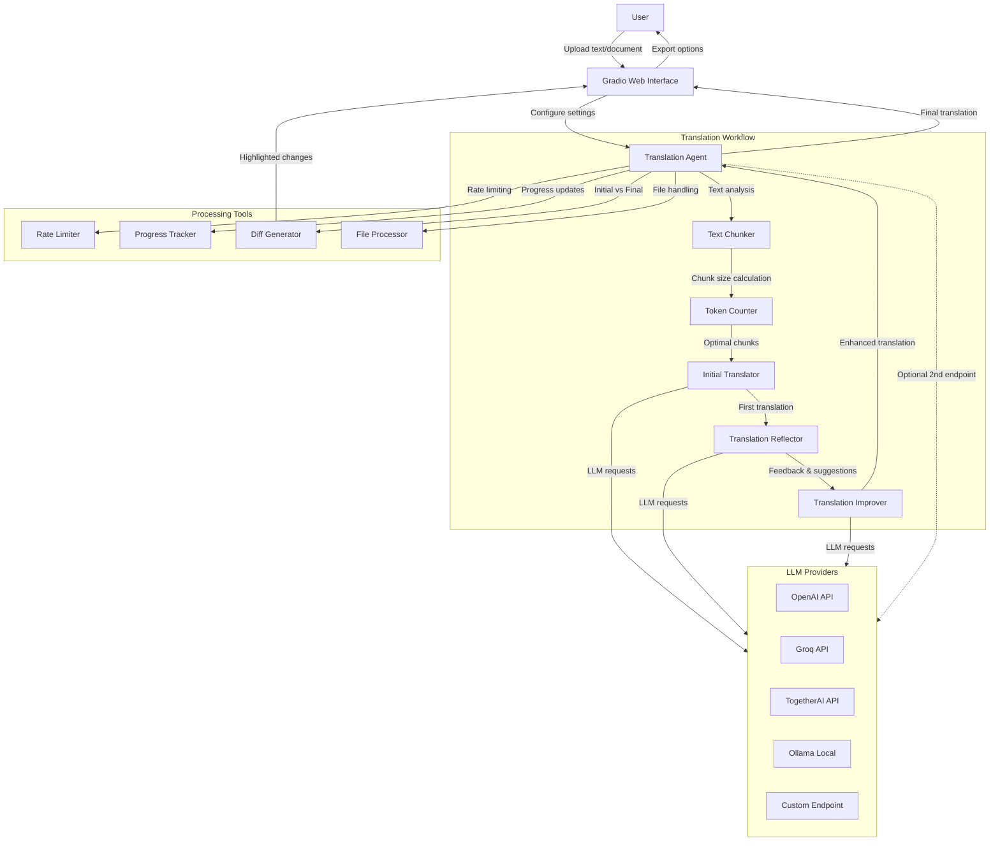

# Translation Agent

## Agents / Agentic Workflows Name

- **Translation Agent**: Core agent that orchestrates the entire translation workflow
- **Initial Translator**: Performs the first translation from source to target language
- **Translation Reflector**: Analyzes the initial translation and provides constructive criticism
- **Translation Improver**: Creates an enhanced translation based on reflection feedback
- **Text Chunker**: Handles large texts by breaking them into manageable chunks
- **Web UI Handler**: Manages user interactions through the Gradio interface

## Agent / Workflow Description

This is an agentic translation system that uses a reflection-based workflow to improve translation quality through iterative refinement:

1. The **Translation Agent** receives text in a source language and coordinates the multi-step translation process
2. The **Initial Translator** creates a first-pass translation from source to target language using an LLM
3. The **Translation Reflector** analyzes the initial translation, providing constructive criticism and suggestions for improvement focusing on accuracy, fluency, style, and terminology
4. The **Translation Improver** takes the original text, initial translation, and reflection feedback to create an enhanced final translation
5. For large texts, the **Text Chunker** divides content into smaller segments that are processed individually with contextual awareness
6. The **Web UI Handler** provides an interactive Gradio interface allowing users to upload documents, configure translation settings, and compare translations with diff visualization
7. The system supports multiple LLM providers (OpenAI, Groq, TogetherAI, Ollama) and includes rate limiting and progress tracking

## Domain / Industry

Translation and Language Processing

## Tools / Functions Used By Agents

### Translation Agent:
- `translate`: Main translation orchestrator function
- `model_load`: Configures LLM client and parameters
- Rate limiting with `@rate_limit` decorator
- Progress tracking with Gradio Progress

### Initial Translator:
- `one_chunk_initial_translation`: Translates single text chunks
- `multichunk_initial_translation`: Handles multi-chunk translations with context
- Uses LLM completion via `get_completion` function

### Translation Reflector:
- `one_chunk_reflect_on_translation`: Provides feedback on single chunk translations
- `multichunk_reflect_on_translation`: Analyzes translations in context of surrounding chunks
- Focuses on accuracy, fluency, style, and terminology assessment

### Translation Improver:
- `one_chunk_improve_translation`: Enhances translations based on reflection feedback
- `multichunk_improve_translation`: Improves chunk translations with full context
- Incorporates expert suggestions into final translation

### Text Chunker:
- `calculate_chunk_size`: Determines optimal chunk sizes based on token limits
- `num_tokens_in_string`: Counts tokens using tiktoken encoding
- `RecursiveCharacterTextSplitter`: Splits large texts while preserving context

### Web UI Handler:
- `huanik`: Main UI processing function
- `diff_texts`: Creates highlighted diff between initial and final translations
- `read_doc`: Extracts text from various file formats (PDF, DOCX, TXT, etc.)
- `export_txt`: Saves translations to files

### Supporting Tools:
- **OpenAI API**: Primary LLM provider for translation tasks
- **Groq API**: Alternative LLM provider for faster inference
- **TogetherAI API**: Additional LLM provider option
- **Ollama**: Local LLM deployment option
- **tiktoken**: Token counting and text encoding
- **langchain_text_splitters**: Intelligent text chunking
- **PyMuPDF**: PDF text extraction
- **python-docx**: DOCX document processing
- **Gradio**: Web interface framework
- **simplemma**: Text tokenization for diff generation

## Architecture Design

The architecture demonstrates a sophisticated agentic translation system that combines multiple specialized agents in a reflection-based workflow. The system processes text through iterative improvement cycles, supports multiple LLM providers for flexibility, and provides a user-friendly web interface with advanced features like diff visualization and document processing. The chunking mechanism allows handling of large documents while maintaining translation quality and context awareness.
