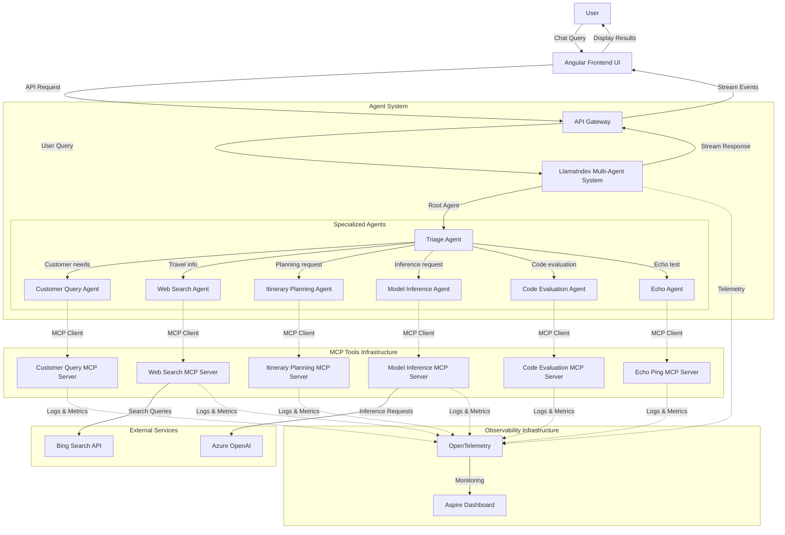

# AI Travel Agents

## Agents / Agentic Workflows Name

- **Triage Agent**: Acts as the root agent that determines the best course of action for the user's query
- **Customer Query Agent**: Assists employees in better understanding customer needs and preferences
- **Web Search Agent**: Searches the web for up-to-date travel information
- **Itinerary Planning Agent**: Creates travel itineraries based on user preferences and requirements
- **Model Inference Agent**: Performs model inference tasks based on user input
- **Code Evaluation Agent**: Evaluates code snippets and provides feedback
- **Echo Agent**: Simple agent that echoes back the received input (primarily used for testing)

## Agent / Workflow Description

This is a travel agency agentic workflow that orchestrates multiple specialized agents to assist employees with customer queries:

1. The **Triage Agent** acts as the entry point, determining which specialized agent should handle the user query
2. The **Customer Query Agent** extracts and understands customer preferences and needs from natural language queries
3. The **Web Search Agent** uses Bing Search to find up-to-date travel information
4. The **Itinerary Planning Agent** creates detailed travel plans based on destination, dates, and user preferences
5. The **Model Inference Agent** runs custom LLM models for specialized tasks
6. The **Code Evaluation Agent** handles evaluation of code snippets when needed
7. The **Echo Agent** is used primarily for testing and development

The system employs the LlamaIndex multi-agent orchestration framework to coordinate agent activities. When a user submits a query, the system determines the most appropriate agent to handle it, and agents can interact with each other or hand off tasks as needed.

## Domain / Industry

Travel and Tourism

## Tools / Functions Used By Agents

### Customer Query Agent:
- Various tools for understanding and processing customer preferences and needs (not fully detailed in the code)

### Web Search Agent:
- Bing Search integration for fetching up-to-date travel information

### Itinerary Planning Agent:
- `suggest_hotels`: Searches for hotels based on location and dates
- `suggest_flights`: Finds flights based on locations and dates

### Destination Recommendation Agent:
- `echoMessage`: Echoes back the input message
- `getDestinationsByActivity`: Provides destination recommendations based on activity type
- `getDestinationsByBudget`: Provides destination recommendations based on budget category
- `getDestinationsBySeason`: Provides destination recommendations based on preferred season
- `getDestinationsByPreferences`: Provides destination recommendations based on multiple criteria
- `getAllDestinations`: Gets a list of all available travel destinations

### Model Inference Agent:
- Custom LLM inference capabilities (not fully detailed in the code)

### Code Evaluation Agent:
- Code analysis and feedback tools (not fully detailed in the code)

### Echo Agent:
- `echo`: Simple tool that echoes back input values

## Architecture Design

The architecture showcases a multi-agent system built using LlamaIndex, where specialized agents communicate through the Model Context Protocol (MCP). The system employs a triage agent to determine which specialized agent should handle each query, and agents can collaborate by passing information between each other. The Angular UI provides a chat-based interface, and the entire system is monitored through OpenTelemetry integration with an Aspire Dashboard. Each agent connects to its own MCP server built with different technologies (Python, Java, Node.js), demonstrating a polyglot microservice architecture.
